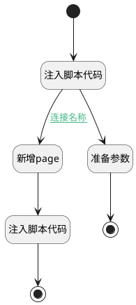

## ai添加page <!-- {docsify-ignore-all} -->

   

### 处理过程




### 处理步骤说明

#### 开始 :id=Begin<sup class="footnote-symbol"> <font color=gray size=1>[开始]</font></sup>


#### 注入脚本代码 :id=RAWJSCODE_01<sup class="footnote-symbol"> <font color=gray size=1>[直接前台代码]</font></sup>


<p class="panel-title"><b>执行代码</b></p>

```javascript

console.info("ai callback");
var answer = null;
var realView = view;
var _entity_tag = view.context._entity_tag;
if (realView.model.appDataEntityId && realView.model.appDataEntityId.endsWith("ai_agent_assignment")) {
    realView = view.parentView;
}
if (!_entity_tag) {
    _entity_tag = realView.model.appDataEntityId ? realView.model.appDataEntityId.split('.').at(-1) : "";
}
if (_entity_tag) {
    uiLogic.default._entity_tag = _entity_tag;
}
//var formController = realView.getController("form");
var curData = {};
var from = "from: AI智能体\n";
if (uiLogic.default.data && uiLogic.default.data.messages && uiLogic.default.data.messages.length > 0) {
    const lastAns = uiLogic.default.data.messages[uiLogic.default.data.messages.length - 1];
    answer = lastAns.realcontent;
    if(uiLogic.default.data.aiChat && 
        uiLogic.default.data.aiChat.appendCurData ) {
        curData = uiLogic.default.data.aiChat.appendCurData;
    }
      if(uiLogic.default.data.caption) {
        from = "from: "+uiLogic.default.data.caption+"\n";
    }
}
else if (uiLogic.default.msg) {
    answer = uiLogic.default.msg.realcontent;
    if(uiLogic.default.topic && uiLogic.default.topic.aiChat && 
        uiLogic.default.topic.aiChat.appendCurData ) {
        curData = uiLogic.default.topic.aiChat.appendCurData;
    }
    if(uiLogic.default.topic && uiLogic.default.topic.caption) {
        from = "from: "+uiLogic.default.topic.caption +"\n";
    }
}

uiLogic.entity = {};

var project  = realView.context.project ? realView.context.project : realView.context.product;
if (!project) {
     project = curData.project_id || curData.product_id;
}
if (!project) {
    ibiz.message.error('未找到关联的知识空间');
}
else  if (answer && typeof answer == 'string') {
    uiLogic.entity.name = curData.title || curData.name; 
    uiLogic.entity.content = from+answer;
    uiLogic.entity.project = project; 
}

```

#### 新增page :id=DEACTION_01<sup class="footnote-symbol"> <font color=gray size=1>[实体行为]</font></sup>


调用实体 [页面(PAGE)](module/Wiki/article_page.md) 行为 [AI创建页面(ai_create_page)](module/Wiki/article_page#行为) ，行为参数为`entity`

#### 准备参数 :id=PREPAREJSPARAM_01<sup class="footnote-symbol"> <font color=gray size=1>[准备参数]</font></sup>


1. 将`未找到关联的知识空间` 设置给  `result.content`

#### 注入脚本代码 :id=RAWJSCODE_02<sup class="footnote-symbol"> <font color=gray size=1>[直接前台代码]</font></sup>


<p class="panel-title"><b>执行代码</b></p>

```javascript
view.parentView.call("Refresh");
ibiz.message.success('已添加到知识空间');
uiLogic.result={content: "已添加到知识空间"};
```

#### 结束 :id=END_02<sup class="footnote-symbol"> <font color=gray size=1>[结束]</font></sup>


#### 结束 :id=END_01<sup class="footnote-symbol"> <font color=gray size=1>[结束]</font></sup>


### 连接条件说明
#### 连接名称 :id=RAWJSCODE_01-DEACTION_01

```entity(entity).content``` ISNOTNULL AND ```entity(entity).project``` ISNOTNULL


### 实体逻辑参数

|    中文名   |    代码名    |  数据类型      |备注 |
| --------| --------| --------  | --------   |
|result|result|数据对象||
|传入变量(<i class="fa fa-check"/></i>)|Default|数据对象||
|entity|entity|数据对象||
