## 自动保存 <!-- {docsify-ignore-all} -->

   

### 处理过程

```plantuml
@startuml
hide footbox
<style>
root {
  HyperlinkColor #42b983
}
</style>

hide empty description
state "开始" as Begin <<start>> [[$./auto_save#begin {开始}]]
state "调试逻辑参数" as DEBUGPARAM1  [[$./auto_save#debugparam1 {调试逻辑参数}]]
state "准备参数" as PREPAREJSPARAM1  [[$./auto_save#preparejsparam1 {准备参数}]]
state "静默保存" as VIEWCTRLINVOKE1  [[$./auto_save#viewctrlinvoke1 {静默保存}]]


Begin --> DEBUGPARAM1
DEBUGPARAM1 --> PREPAREJSPARAM1
PREPAREJSPARAM1 --> VIEWCTRLINVOKE1 : [[$./auto_save#preparejsparam1-viewctrlinvoke1{值是否变更} 值是否变更]]


@enduml
```




### 处理步骤说明

#### 开始 :id=Begin<sup class="footnote-symbol"> <font color=gray size=1>[开始]</font></sup>


#### 调试逻辑参数 :id=DEBUGPARAM1<sup class="footnote-symbol"> <font color=gray size=1>[调试逻辑参数]</font></sup>


> [!NOTE|label:调试信息|icon:fa fa-bug]
> 调试输出参数`传入变量`的详细信息

#### 准备参数 :id=PREPAREJSPARAM1<sup class="footnote-symbol"> <font color=gray size=1>[准备参数]</font></sup>


1. 将`true` 设置给  `param(参数).silent`

#### 静默保存 :id=VIEWCTRLINVOKE1<sup class="footnote-symbol"> <font color=gray size=1>[视图部件调用]</font></sup>


调用`FORM(表单)`的方法`save`，参数为`param(参数)`
### 连接条件说明
#### 值是否变更 :id=PREPAREJSPARAM1-VIEWCTRLINVOKE1

```FORM(表单).state.modified``` EQ ```true```


### 实体逻辑参数

|    中文名   |    代码名    |  数据类型      |备注 |
| --------| --------| --------  | --------   |
|参数|param|数据对象||
|传入变量(<i class="fa fa-check"/></i>)|Default|数据对象||
|表单|FORM|部件对象||
