## 切换导航树显示状态 <!-- {docsify-ignore-all} -->

   切换页面导航树显示状态

### 处理过程

```plantuml
@startuml
hide footbox
<style>
root {
  HyperlinkColor #42b983
}
</style>

hide empty description
state "开始" as Begin <<start>> [[$./change_tree_state#begin {开始}]]
state "结束" as END2 <<end>> [[$./change_tree_state#end2 {结束}]]
state "切换树正常状态" as VIEWCTRLINVOKE2  [[$./change_tree_state#viewctrlinvoke2 {切换树正常状态}]]
state "设置eventArgs" as PREPAREJSPARAM2  [[$./change_tree_state#preparejsparam2 {设置eventArgs}]]
state "切换草稿状态" as VIEWCTRLINVOKE1  [[$./change_tree_state#viewctrlinvoke1 {切换草稿状态}]]
state "设置eventArgs" as PREPAREJSPARAM3  [[$./change_tree_state#preparejsparam3 {设置eventArgs}]]


Begin --> PREPAREJSPARAM2 : [[$./change_tree_state#begin-preparejsparam2{未发布状态} 未发布状态]]
PREPAREJSPARAM2 --> VIEWCTRLINVOKE1
VIEWCTRLINVOKE1 --> END2
Begin --> PREPAREJSPARAM3 : [[$./change_tree_state#begin-preparejsparam3{发布状态} 发布状态]]
PREPAREJSPARAM3 --> VIEWCTRLINVOKE2
VIEWCTRLINVOKE2 --> END2


@enduml
```




### 处理步骤说明

#### 设置eventArgs :id=PREPAREJSPARAM2<sup class="footnote-symbol"> <font color=gray size=1>[准备参数]</font></sup>


1. 将`draft` 设置给  `eventArgs(事件参数)`

#### 切换草稿状态 :id=VIEWCTRLINVOKE1<sup class="footnote-symbol"> <font color=gray size=1>[视图部件调用]</font></sup>


调用`treeexpbar_tree(树)`的方法`changeTreeState`，参数为`eventArgs(事件参数)`
#### 开始 :id=Begin<sup class="footnote-symbol"> <font color=gray size=1>[开始]</font></sup>


#### 结束 :id=END2<sup class="footnote-symbol"> <font color=gray size=1>[结束]</font></sup>


#### 设置eventArgs :id=PREPAREJSPARAM3<sup class="footnote-symbol"> <font color=gray size=1>[准备参数]</font></sup>


1. 将`no_draft` 设置给  `eventArgs(事件参数)`

#### 切换树正常状态 :id=VIEWCTRLINVOKE2<sup class="footnote-symbol"> <font color=gray size=1>[视图部件调用]</font></sup>


调用`treeexpbar_tree(树)`的方法`changeTreeState`，参数为`eventArgs(事件参数)`
### 连接条件说明
#### 未发布状态 :id=Begin-PREPAREJSPARAM2

```Default(传入变量).is_published``` EQ ```false```
#### 发布状态 :id=Begin-PREPAREJSPARAM3

```Default(传入变量).is_published``` EQ ```true```


### 实体逻辑参数

|    中文名   |    代码名    |  数据类型      |备注 |
| --------| --------| --------  | --------   |
|传入变量(<i class="fa fa-check"/></i>)|Default|数据对象||
|事件参数|eventArgs|简单数据||
|树|treeexpbar_tree|部件对象||
|视图|view|当前视图对象||
