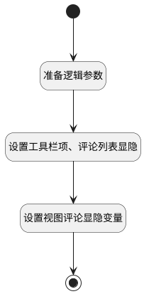

## 关闭评论区 <!-- {docsify-ignore-all} -->

   隐藏评论区，同时显示评论按钮

### 处理过程

### 处理步骤说明

#### 开始 :id=Begin [开始]

#### 结束 :id=END1 [结束]

#### 准备逻辑参数 :id=PREPAREJSPARAM1 [准备参数]

1. 将`view.layoutPanel.panelItems.right_container.state` 设置给  `right_grouppanel_state(容器状态)`
2. 将`toolbar(工具栏).state.buttonsState.deuiaction3` 设置给  `button3_state_obj(关闭按钮状态)`
3. 将`toolbar(工具栏).state.buttonsState.deuiaction2` 设置给  `button2_state_obj(评论按钮状态)`

#### 设置工具栏项、评论列表显隐 :id=PREPAREJSPARAM3 [准备参数]

1. 将`false` 设置给  `right_grouppanel_state(容器状态).visible`
2. 将`false` 设置给  `button3_state_obj(关闭按钮状态).visible`
3. 将`true` 设置给  `button2_state_obj(评论按钮状态).visible`

#### 设置视图评论显隐变量 :id=PREPAREJSPARAM4 [准备参数]

1. 将`false` 设置给  `view.common_list_isshow`

### 实体逻辑参数

|    中文名   |    代码名    |  数据类型      |备注 |
| --------| --------| --------  | --------   |
|传入变量(<i class="fa fa-check"/></i>)|Default|数据对象||
|form|form|部件对象||
|view|view|当前视图对象||
|容器状态|right_grouppanel_state|数据对象||
|关闭按钮状态|button3_state_obj|数据对象||
|工具栏|toolbar|部件对象||
|评论按钮状态|button2_state_obj|数据对象||
