## 复制共享链接 <!-- {docsify-ignore-all} -->

   复制共享页面链接

### 处理过程

```plantuml
@startuml
hide footbox
<style>
root {
  HyperlinkColor #42b983
}
</style>

hide empty description
state "开始" as Begin <<start>> [[$./copy_shared_url#begin {开始}]]
state "结束" as END1 <<end>> [[$./copy_shared_url#end1 {结束}]]
state "复制共享链接" as RAWJSCODE1  [[$./copy_shared_url#rawjscode1 {复制共享链接}]]


Begin --> RAWJSCODE1
RAWJSCODE1 --> END1


@enduml
```




### 处理步骤说明

#### 开始 :id=Begin<sup class="footnote-symbol"> <font color=gray size=1>[开始]</font></sup>


#### 复制共享链接 :id=RAWJSCODE1<sup class="footnote-symbol"> <font color=gray size=1>[直接前台代码]</font></sup>


<p class="panel-title"><b>执行代码</b></p>

```javascript
var _default = uiLogic.default;
var shared_url = _default.shared_page_url;
if(shared_url !== null && shared_url !== undefined){
    var textArea = document.createElement("textarea");
    // 在 textarea 中放入需要复制的文本
    textArea.readOnly = true;
    textArea.value = shared_url;
    // 将 textarea 添加到 DOM 中
    document.body.appendChild(textArea);
    // 选中 textarea 中的文本
    textArea.select();
    // 执行复制命令
    var successful = document.execCommand('copy');
    var msg = successful ? '' : '复制失败';
    if(successful){
        util.message.success('复制共享链接成功');
    } else {
        util.message.error('复制共享链接失败!');
    }
} else {
    util.message.error('复制共享链接失败!');
}

```

#### 结束 :id=END1<sup class="footnote-symbol"> <font color=gray size=1>[结束]</font></sup>


### 实体逻辑参数

|    中文名   |    代码名    |  数据类型      |备注 |
| --------| --------| --------  | --------   |
|传入变量(<i class="fa fa-check"/></i>)|Default|数据对象||
