## 删除页面显示隐藏 <!-- {docsify-ignore-all} -->

   已删除页面显示隐藏

### 处理过程

```plantuml
@startuml
hide footbox
<style>
root {
  HyperlinkColor #42b983
}
</style>

hide empty description
state "开始" as Begin <<start>> [[$./deleted_visible#begin {开始}]]
state "结束" as END1 <<end>> [[$./deleted_visible#end1 {结束}]]
state "准备参数" as PREPAREJSPARAM1  [[$./deleted_visible#preparejsparam1 {准备参数}]]


Begin --> END1 : [[$./deleted_visible#begin-end1{连接名称} 连接名称]]


@enduml
```




### 处理步骤说明

#### 开始 :id=Begin<sup class="footnote-symbol"> <font color=gray size=1>[开始]</font></sup>


#### 结束 :id=END1<sup class="footnote-symbol"> <font color=gray size=1>[结束]</font></sup>


#### 准备参数 :id=PREPAREJSPARAM1<sup class="footnote-symbol"> <font color=gray size=1>[准备参数]</font></sup>


1. 将`view.layoutPanel.panelItems.viewmsg_pos.state` 设置给  `viewmsg_pos_state(视图消息占位状态)`
2. 将`true` 设置给  `view.common_list_isshow`
3. 将`true` 设置给  `viewmsg_pos_state(视图消息占位状态).visible`

### 连接条件说明
#### 连接名称 :id=Begin-END1

```Default(传入变量).is_deleted``` EQ ```1```


### 实体逻辑参数

|    中文名   |    代码名    |  数据类型      |备注 |
| --------| --------| --------  | --------   |
|传入变量(<i class="fa fa-check"/></i>)|Default|数据对象||
|视图消息占位|viewmsg_pos|数据对象||
|view|view|当前视图对象||
|视图消息占位状态|viewmsg_pos_state|数据对象||
