## 获取草稿数据 <!-- {docsify-ignore-all} -->

   

### 处理过程

```plantuml
@startuml
hide footbox
<style>
root {
  HyperlinkColor #42b983
}
</style>

hide empty description
state "开始" as Begin <<start>> [[$./get_draft_data#begin {开始}]]
state "获取草稿数据" as DEACTION1  [[$./get_draft_data#deaction1 {获取草稿数据}]]
state "设置spaceid" as PREPAREJSPARAM1  [[$./get_draft_data#preparejsparam1 {设置spaceid}]]
state "结束" as END1 <<end>> [[$./get_draft_data#end1 {结束}]]
state "切换显示草稿页" as RAWJSCODE1  [[$./get_draft_data#rawjscode1 {切换显示草稿页}]]


Begin --> PREPAREJSPARAM1
PREPAREJSPARAM1 --> DEACTION1
DEACTION1 --> RAWJSCODE1
RAWJSCODE1 --> END1


@enduml
```




### 处理步骤说明

#### 开始 :id=Begin<sup class="footnote-symbol"> <font color=gray size=1>[开始]</font></sup>


#### 结束 :id=END1<sup class="footnote-symbol"> <font color=gray size=1>[结束]</font></sup>


#### 设置spaceid :id=PREPAREJSPARAM1<sup class="footnote-symbol"> <font color=gray size=1>[准备参数]</font></sup>


1. 将`context(上下文).space` 设置给  `requestData(请求数据对象).space_id`

#### 获取草稿数据 :id=DEACTION1<sup class="footnote-symbol"> <font color=gray size=1>[实体行为]</font></sup>


调用实体 [页面(PAGE)](module/Wiki/article_page.md) 行为 [获取草稿页面(get_draft_pages)](module/Wiki/article_page#行为) ，行为参数为`requestData(请求数据对象)`

将执行结果返回给参数`items(草稿数据)`

#### 切换显示草稿页 :id=RAWJSCODE1<sup class="footnote-symbol"> <font color=gray size=1>[直接前台代码]</font></sup>


<p class="panel-title"><b>执行代码</b></p>

```javascript
const tree = uiLogic.treeexpbar_tree;
if (tree) {
    const openview = (item) => {
        const nav_pos = uiLogic.view.layoutPanel.panelItems.nav_pos;
        if (nav_pos) {
            const context = tree.context.clone();
            Object.assign(context, {article_page: item.id})
            const openViewMsg = {
                viewId: "plmweb.article_page_show_view",
                fullPath: '',
                isCache: false,
                isRoutePushed: false,
                key: item.id,
                params: tree.params,
                context: context,
            }
            nav_pos.openView(openViewMsg)
        }
    }
    tree.setFilterData('草稿', uiLogic.items, openview);
}
```


### 实体逻辑参数

|    中文名   |    代码名    |  数据类型      |备注 |
| --------| --------| --------  | --------   |
|传入变量(<i class="fa fa-check"/></i>)|Default|数据对象||
|请求数据对象|requestData|数据对象||
|上下文|context|导航视图参数绑定参数||
|树|treeexpbar_tree|部件对象||
|草稿数据|items|数据对象列表||
|视图|view|当前视图对象||
