## 获取模板 <!-- {docsify-ignore-all} -->

   测试。新建时获取模板信息

### 处理过程

```plantuml
@startuml
hide footbox
<style>
root {
  HyperlinkColor #42b983
}
</style>

hide empty description
state "开始" as Begin <<start>> [[$./get_stencil_info#begin {开始}]]
state "调试逻辑参数" as DEBUGPARAM2  [[$./get_stencil_info#debugparam2 {调试逻辑参数}]]
state "调试逻辑参数" as DEBUGPARAM1  [[$./get_stencil_info#debugparam1 {调试逻辑参数}]]
state "准备参数" as PREPAREJSPARAM1  [[$./get_stencil_info#preparejsparam1 {准备参数}]]
state "结束" as END1 <<end>> [[$./get_stencil_info#end1 {结束}]]


Begin --> DEBUGPARAM1
DEBUGPARAM1 --> PREPAREJSPARAM1
PREPAREJSPARAM1 --> DEBUGPARAM2
DEBUGPARAM2 --> END1


@enduml
```

### 处理步骤说明

#### 开始 :id=Begin [开始]

#### 结束 :id=END1 [结束]

#### 调试逻辑参数 :id=DEBUGPARAM1 [调试逻辑参数]

> [!NOTE|label:调试信息|icon:fa fa-bug]
> 调试输出参数`view`的详细信息

#### 准备参数 :id=PREPAREJSPARAM1 [准备参数]

1. 将`form.details.mdctrl1.mdController.state.selectedData` 绑定给  `selectdata(选中数据)`

#### 调试逻辑参数 :id=DEBUGPARAM2 [调试逻辑参数]

> [!NOTE|label:调试信息|icon:fa fa-bug]
> 调试输出参数`选中数据`的详细信息

### 实体逻辑参数

|    中文名   |    代码名    |  数据类型      |备注 |
| --------| --------| --------  | --------   |
|view|view|当前视图对象||
|传入变量(<i class="fa fa-check"/></i>)|Default|数据对象||
|form|form|部件对象||
|ctx|ctx|导航视图参数绑定参数||
|选中数据|selectdata|数据对象||
