## 恢复历史版本并通知刷新 <!-- {docsify-ignore-all} -->

   恢复到指定版本，并调用刷新方法

### 处理过程

```plantuml
@startuml
hide footbox
<style>
root {
  HyperlinkColor #42b983
}
</style>

hide empty description
state "开始" as Begin <<start>> [[$./page_refresh#begin {开始}]]
state "通知刷新" as RAWJSCODE1  [[$./page_refresh#rawjscode1 {通知刷新}]]
state "结束" as END1 <<end>> [[$./page_refresh#end1 {结束}]]
state "恢复历史版本" as DEUIACTION1  [[$./page_refresh#deuiaction1 {恢复历史版本}]]


Begin --> DEUIACTION1
DEUIACTION1 --> RAWJSCODE1
RAWJSCODE1 --> END1


@enduml
```




### 处理步骤说明

#### 开始 :id=Begin<sup class="footnote-symbol"> <font color=gray size=1>[开始]</font></sup>


#### 恢复历史版本 :id=DEUIACTION1<sup class="footnote-symbol"> <font color=gray size=1>[实体界面行为调用]</font></sup>


调用实体 [页面(PAGE)](module/Wiki/article_page.md) 界面行为 [恢复历史版本](module/Wiki/article_page#界面行为) ，行为参数为`Default(传入变量)`

#### 通知刷新 :id=RAWJSCODE1<sup class="footnote-symbol"> <font color=gray size=1>[直接前台代码]</font></sup>


<p class="panel-title"><b>执行代码</b></p>

```javascript
view.parentView.state.isLoading = false;
view.parentView.closeView();
ibiz.mc.command.send({srfdecodename: 'article_page',srfkey:uiLogic.context.article_page}, 'OBJECTUPDATED',uiLogic.form.triggerKey);
```

#### 结束 :id=END1<sup class="footnote-symbol"> <font color=gray size=1>[结束]</font></sup>


### 实体逻辑参数

|    中文名   |    代码名    |  数据类型      |备注 |
| --------| --------| --------  | --------   |
|传入变量(<i class="fa fa-check"/></i>)|Default|数据对象||
|应用上下文|context|导航视图参数绑定参数||
|form对象|form|部件对象||
