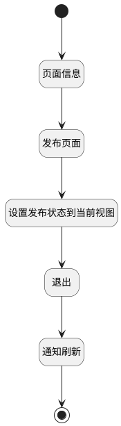

## 新建发布并通知刷新 <!-- {docsify-ignore-all} -->

   保存当前页面内容并刷新页面，点击发布按钮，触发保存非草稿页面

### 处理过程




### 处理步骤说明

#### 开始 :id=Begin<sup class="footnote-symbol"> <font color=gray size=1>[开始]</font></sup>


#### 页面信息 :id=PREPAREJSPARAM1<sup class="footnote-symbol"> <font color=gray size=1>[准备参数]</font></sup>


1. 将`Default(传入变量)` 拷贝到  `page_info(页面信息)`

#### 发布页面 :id=DEACTION1<sup class="footnote-symbol"> <font color=gray size=1>[实体行为]</font></sup>


调用实体 [页面(PAGE)](module/Wiki/article_page.md) 行为 [发布页面(publish_page)](module/Wiki/article_page#行为) ，行为参数为`page_info(页面信息)`

将执行结果返回给参数`page_info(页面信息)`

#### 设置发布状态到当前视图 :id=PREPAREJSPARAM2<sup class="footnote-symbol"> <font color=gray size=1>[准备参数]</font></sup>


1. 将`page_info(页面信息).is_published` 设置给  `view(当前视图).is_published`

#### 退出 :id=DEUIACTION2<sup class="footnote-symbol"> <font color=gray size=1>[实体界面行为调用]</font></sup>


调用实体 [页面(PAGE)](module/Wiki/article_page.md) 界面行为 [编辑界面_退出操作](module/Wiki/article_page#界面行为) ，行为参数为`page_info(页面信息)`

#### 通知刷新 :id=RAWJSCODE1<sup class="footnote-symbol"> <font color=gray size=1>[直接前台代码]</font></sup>


<p class="panel-title"><b>执行代码</b></p>

```javascript
ibiz.mc.command.send({srfdecodename: 'article_page'}, 'OBJECTCREATED');
```

#### 结束 :id=END1<sup class="footnote-symbol"> <font color=gray size=1>[结束]</font></sup>


### 实体逻辑参数

|    中文名   |    代码名    |  数据类型      |备注 |
| --------| --------| --------  | --------   |
|当前视图|view|当前视图对象||
|页面信息|page_info|数据对象||
|传入变量(<i class="fa fa-check"/></i>)|Default|数据对象||
