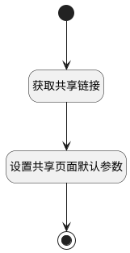

## 共享设置表单加载数据 <!-- {docsify-ignore-all} -->

   共享设置表单加载数据

### 处理过程




### 处理步骤说明

#### 开始 :id=Begin<sup class="footnote-symbol"> <font color=gray size=1>[开始]</font></sup>


#### 获取共享链接 :id=DEACTION1<sup class="footnote-symbol"> <font color=gray size=1>[实体行为]</font></sup>


调用实体 [页面(PAGE)](module/Wiki/article_page.md) 行为 [获取页面共享链接(shared_url)](module/Wiki/article_page#行为) ，行为参数为`Default(传入变量)`

将执行结果返回给参数`Default(传入变量)`

#### 设置共享页面默认参数 :id=RAWJSCODE1<sup class="footnote-symbol"> <font color=gray size=1>[直接前台代码]</font></sup>


<p class="panel-title"><b>执行代码</b></p>

```javascript

var form = view.layoutPanel.panelItems.form.control.details
var shared_scope = form.shared_scope;
var enable_password = form.enable_password;
var enable_expiration = form.enable_expiration;
var access_password = form.access_password;
var expiration_date = form.expiration_date;
var _url = uiLogic.default.shared_page_url;
if(_url !== null && _url !== undefined) {
    var shared_url = form.shared_page_url;
    shared_url.setDataValue(_url);
}
if(expiration_date.value !== null && expiration_date.value !== undefined) {
    enable_expiration.setDataValue(1);
} else {
    enable_expiration.setDataValue(0);
    var today = new Date();  // 获取当前日期
    // 获取 30 天后的日期
    var nextDate = new Date();
    nextDate.setDate(today.getDate() + 30);

    // 获取年、月、日
    var nextYear = nextDate.getFullYear();
    var nextMonth = ('0' + (nextDate.getMonth() + 1)).slice(-2);
    var nextDay = ('0' + nextDate.getDate()).slice(-2);
    // 格式化成 YYYY-MM-DD 的字符串
    var _date = nextYear + '-' + nextMonth + '-' + nextDay;
    expiration_date.setDataValue(_date);
}
if(access_password.value !== null && access_password.value !== undefined) {
    enable_password.setDataValue(1);
} else {
    enable_password.setDataValue(0);
    // 生成4位随机数
    var randomNumber = Math.floor(Math.random() * 9000) + 1000;
    access_password.setDataValue(randomNumber);
}

```

#### 结束 :id=END1<sup class="footnote-symbol"> <font color=gray size=1>[结束]</font></sup>


### 实体逻辑参数

|    中文名   |    代码名    |  数据类型      |备注 |
| --------| --------| --------  | --------   |
|传入变量(<i class="fa fa-check"/></i>)|Default|数据对象||
