## 显示评论区 <!-- {docsify-ignore-all} -->

   打开评论区，同时隐藏评论按钮

### 处理过程

```plantuml
@startuml
hide footbox
<style>
root {
  HyperlinkColor #42b983
}
</style>

hide empty description
state "开始" as Begin <<start>> [[$./show_commnet#begin {开始}]]
state "记录评论状态" as RAWJSCODE1  [[$./show_commnet#rawjscode1 {记录评论状态}]]
state "准备参数" as PREPAREJSPARAM1  [[$./show_commnet#preparejsparam1 {准备参数}]]
state "结束" as END1 <<end>> [[$./show_commnet#end1 {结束}]]
state "设置视图参数" as PREPAREJSPARAM3  [[$./show_commnet#preparejsparam3 {设置视图参数}]]
state "准备参数" as PREPAREJSPARAM2  [[$./show_commnet#preparejsparam2 {准备参数}]]


Begin --> PREPAREJSPARAM1
PREPAREJSPARAM1 --> PREPAREJSPARAM2
PREPAREJSPARAM2 --> PREPAREJSPARAM3
PREPAREJSPARAM3 --> RAWJSCODE1
RAWJSCODE1 --> END1


@enduml
```




### 处理步骤说明

#### 开始 :id=Begin<sup class="footnote-symbol"> <font color=gray size=1>[开始]</font></sup>


#### 结束 :id=END1<sup class="footnote-symbol"> <font color=gray size=1>[结束]</font></sup>


#### 准备参数 :id=PREPAREJSPARAM1<sup class="footnote-symbol"> <font color=gray size=1>[准备参数]</font></sup>


1. 将`view.layoutPanel.panelItems.right_container.state` 设置给  `right_grouppanel_state(容器状态)`
2. 将`toolbar(工具栏).state.buttonsState.deuiaction3` 设置给  `button3_state_obj(关闭按钮状态)`
3. 将`toolbar(工具栏).state.buttonsState.deuiaction2` 设置给  `button2_state_obj(评论按钮状态)`

#### 准备参数 :id=PREPAREJSPARAM2<sup class="footnote-symbol"> <font color=gray size=1>[准备参数]</font></sup>


1. 将`true` 设置给  `right_grouppanel_state(容器状态).visible`
2. 将`true` 设置给  `button3_state_obj(关闭按钮状态).visible`
3. 将`false` 设置给  `button2_state_obj(评论按钮状态).visible`

#### 设置视图参数 :id=PREPAREJSPARAM3<sup class="footnote-symbol"> <font color=gray size=1>[准备参数]</font></sup>


1. 将`true` 设置给  `view.common_list_isshow`

#### 记录评论状态 :id=RAWJSCODE1<sup class="footnote-symbol"> <font color=gray size=1>[直接前台代码]</font></sup>


<p class="panel-title"><b>执行代码</b></p>

```javascript
const operator = context.loginname;

localStorage.setItem(operator, 'true');
```


### 实体逻辑参数

|    中文名   |    代码名    |  数据类型      |备注 |
| --------| --------| --------  | --------   |
|工具栏|toolbar|部件对象||
|容器状态|right_grouppanel_state|数据对象||
|关闭按钮状态|button3_state_obj|数据对象||
|传入变量(<i class="fa fa-check"/></i>)|Default|数据对象||
|view|view|当前视图对象||
|评论按钮状态|button2_state_obj|数据对象||
|滚动条容器1|container_scroll1|部件对象||
|form|form|部件对象||
