## 切换显示草稿数据 <!-- {docsify-ignore-all} -->

   

### 处理过程

```plantuml
@startuml
hide footbox
<style>
root {
  HyperlinkColor #42b983
}
</style>

hide empty description
state "开始" as Begin <<start>> [[$./switch_show_draft#begin {开始}]]
state "准备参数" as PREPAREJSPARAM1  [[$./switch_show_draft#preparejsparam1 {准备参数}]]
state "界面行为" as DEUIACTION1  [[$./switch_show_draft#deuiaction1 {界面行为}]]
state "结束" as END1 <<end>> [[$./switch_show_draft#end1 {结束}]]


Begin --> PREPAREJSPARAM1
PREPAREJSPARAM1 --> DEUIACTION1
DEUIACTION1 --> END1


@enduml
```

### 处理步骤说明

#### 开始 :id=Begin [开始]

#### 界面行为 :id=DEUIACTION1 [实体界面行为调用]

调用实体 [页面(PAGE)](module/Wiki/article_page.md) 界面行为 [切换草稿](module/Wiki/article_page#界面行为) ，行为参数为`Default(传入变量)`

#### 结束 :id=END1 [结束]

#### 准备参数 :id=PREPAREJSPARAM1 [准备参数]

1. 将`0` 设置给  `draft_tag(草稿标识).tag`

### 连接条件说明
#### 连接名称 

### 实体逻辑参数

|    中文名   |    代码名    |  数据类型      |备注 |
| --------| --------| --------  | --------   |
|传入变量(<i class="fa fa-check"/></i>)|Default|数据对象||
|草稿标识|draft_tag|数据对象||
