## 查看已发布版本 <!-- {docsify-ignore-all} -->

   查看已发布的版本（页面）

### 处理过程

```plantuml
@startuml
hide footbox
<style>
root {
  HyperlinkColor #42b983
}
</style>

hide empty description
state "开始" as Begin <<start>> [[$./is_published_version#begin {开始}]]
state "准备参数" as PREPAREJSPARAM2  [[$./is_published_version#preparejsparam2 {准备参数}]]
state "准备参数" as PREPAREJSPARAM1  [[$./is_published_version#preparejsparam1 {准备参数}]]
state "准备参数" as PREPAREJSPARAM3  [[$./is_published_version#preparejsparam3 {准备参数}]]
state "调试逻辑参数" as DEBUGPARAM1  [[$./is_published_version#debugparam1 {调试逻辑参数}]]
state "结束" as END1 <<end>> [[$./is_published_version#end1 {结束}]]


Begin --> PREPAREJSPARAM2
PREPAREJSPARAM2 --> DEBUGPARAM1
DEBUGPARAM1 --> PREPAREJSPARAM1 : [[$./is_published_version#debugparam1-preparejsparam1{连接名称} 连接名称]]
PREPAREJSPARAM1 --> END1
DEBUGPARAM1 --> PREPAREJSPARAM3 : [[$./is_published_version#debugparam1-preparejsparam3{连接名称} 连接名称]]
PREPAREJSPARAM3 --> END1


@enduml
```




### 处理步骤说明

#### 开始 :id=Begin<sup class="footnote-symbol"> <font color=gray size=1>[开始]</font></sup>


#### 结束 :id=END1<sup class="footnote-symbol"> <font color=gray size=1>[结束]</font></sup>


#### 准备参数 :id=PREPAREJSPARAM2<sup class="footnote-symbol"> <font color=gray size=1>[准备参数]</font></sup>


1. 将`view(当前视图对象).layoutPanel.panelItems.field_switch` 设置给  `field_switch(开关)`

#### 调试逻辑参数 :id=DEBUGPARAM1<sup class="footnote-symbol"> <font color=gray size=1>[调试逻辑参数]</font></sup>


> [!NOTE|label:调试信息|icon:fa fa-bug]
> 调试输出参数`开关`的详细信息

#### 准备参数 :id=PREPAREJSPARAM1<sup class="footnote-symbol"> <font color=gray size=1>[准备参数]</font></sup>


1. 将`view(当前视图对象).params` 设置给  `params(视图参数)`
2. 将`1` 设置给  `params(视图参数).n_is_published_eq`

#### 准备参数 :id=PREPAREJSPARAM3<sup class="footnote-symbol"> <font color=gray size=1>[准备参数]</font></sup>


1. 将`view(当前视图对象).params` 设置给  `params(视图参数)`
2. 将`无值（NONE）` 设置给  `params(视图参数).n_is_published_eq`

### 连接条件说明
#### 连接名称 :id=DEBUGPARAM1-PREPAREJSPARAM1

```field_switch(开关).value``` EQ ```1```
#### 连接名称 :id=DEBUGPARAM1-PREPAREJSPARAM3

```field_switch(开关).value``` EQ ```0```


### 实体逻辑参数

|    中文名   |    代码名    |  数据类型      |备注 |
| --------| --------| --------  | --------   |
|开关|field_switch|数据对象||
|视图参数|params|数据对象||
|上下文|ctx|导航视图参数绑定参数||
|当前视图对象|view|当前视图对象||
|传入变量(<i class="fa fa-check"/></i>)|Default|数据对象||
