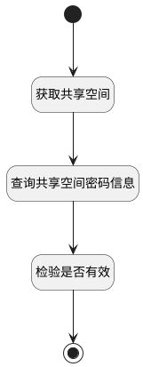

## 检验共享页面 <!-- {docsify-ignore-all} -->

   共享页面打开前，判断是否设置密码和有效期

### 处理过程




### 处理步骤说明

#### 开始 :id=Begin<sup class="footnote-symbol"> <font color=gray size=1>[开始]</font></sup>


*- N/A*
#### 获取共享空间 :id=DEACTION1<sup class="footnote-symbol"> <font color=gray size=1>[实体行为]</font></sup>


调用实体 [共享空间(SHARED_SPACE)](module/Wiki/shared_space.md) 行为 [Get](module/Wiki/shared_space#行为) ，行为参数为`Default(传入变量)`

将执行结果返回给参数`Default(传入变量)`

#### 查询共享空间密码信息 :id=RAWSQLCALL1<sup class="footnote-symbol"> <font color=gray size=1>[直接SQL调用]</font></sup>


<p class="panel-title"><b>执行sql语句</b></p>

```sql
select `ACCESS_PASSWORD` from `space` where id = ?
```

<p class="panel-title"><b>执行sql参数</b></p>

1. `Default(传入变量).id(标识)`

重置参数`Default(传入变量)`，并将执行sql结果赋值给参数`Default(传入变量)`

#### 检验是否有效 :id=RAWSFCODE1<sup class="footnote-symbol"> <font color=gray size=1>[直接后台代码]</font></sup>


<p class="panel-title"><b>执行代码[Groovy]</b></p>

```groovy
def _default = logic.param('default').getReal()
def result = logic.param('result').getReal()
result.set('id', _default.get('id'))
result.set('effective', 1)
result.set('check_access_pwd', 0)
def expiration_date = _default.get('expiration_date')
if(expiration_date != null){
    java.time.LocalDateTime expirationDateTime = expiration_date.toLocalDateTime();
    // 获取当前时间的 java.time.LocalDateTime 对象
    def currentDateTime = java.time.LocalDateTime.now()
    // 将 LocalDateTime 转换为 LocalDate
    def currentDate = currentDateTime.toLocalDate()
    def expirationDate = expirationDateTime.toLocalDate()
    if (expirationDate.isBefore(currentDate)) {
        // 超过有效期
        result.set('effective', 0)
    }
}
if(_default.get('access_password') != null){
    result.set('check_access_pwd', 1)
}
```

#### 结束 :id=END1<sup class="footnote-symbol"> <font color=gray size=1>[结束]</font></sup>


返回 `result`


### 实体逻辑参数

|    中文名   |    代码名    |  数据类型    |  实体   |备注 |
| --------| --------| -------- | -------- | --------   |
|传入变量(<i class="fa fa-check"/></i>)|Default|数据对象|[共享空间(SHARED_SPACE)](module/Wiki/shared_space.md)||
|result|result|数据对象|[共享空间(SHARED_SPACE)](module/Wiki/shared_space.md)||
