## 关闭共享 <!-- {docsify-ignore-all} -->

   关闭共享

### 处理过程

```plantuml
@startuml
hide empty description
<style>
root {
  HyperlinkColor #42b983
}
</style>

hide empty description
state "开始" as Begin <<start>> [[$./closed_shared#begin {"开始"}]]
state "设置页面关闭参数" as PREPAREPARAM1  [[$./closed_shared#prepareparam1 {"设置页面关闭参数"}]]
state "更新页面信息" as DEACTION1  [[$./closed_shared#deaction1 {"更新页面信息"}]]
state "结束" as END1 <<end>> [[$./closed_shared#end1 {"结束"}]]


Begin --> PREPAREPARAM1
PREPAREPARAM1 --> DEACTION1
DEACTION1 --> END1


@enduml
```

### 处理步骤说明

#### 开始 :id=Begin [开始]

*- N/A*
#### 设置页面关闭参数 :id=PREPAREPARAM1 [准备参数]

1. 将`空值（NULL）` 设置给  `Default(传入变量).SHARED_PAGES(共享页面标识)`
2. 将`空值（NULL）` 设置给  `Default(传入变量).SHARED_BY(共享人)`
3. 将`空值（NULL）` 设置给  `Default(传入变量).SHARED_TIME(共享时间)`
4. 将`空值（NULL）` 设置给  `Default(传入变量).SHOW_LOGO(共享展示图标)`
5. 将`空值（NULL）` 设置给  `Default(传入变量).SHOW_TITLE(共享展示标题)`
6. 将`空值（NULL）` 设置给  `Default(传入变量).ACCESS_PASSWORD(访问密码)`
7. 将`0` 设置给  `Default(传入变量).IS_SHARED(是否开启共享)`
8. 将`空值（NULL）` 设置给  `Default(传入变量).EXPIRATION_DATE(共享有效期)`

#### 更新页面信息 :id=DEACTION1 [实体行为]

调用实体 [共享空间(SHARED_SPACE)](module/Wiki/shared_space.md) 行为 [Update](module/Wiki/shared_space#行为) ，行为参数为`Default(传入变量)`

#### 结束 :id=END1 [结束]

*- N/A*

### 实体逻辑参数

|    中文名   |    代码名    |  数据类型    |  实体   |备注 |
| --------| --------| -------- | -------- | --------   |
|传入变量(<i class="fa fa-check"/></i>)|Default|数据对象|[共享空间(SHARED_SPACE)](module/Wiki/shared_space.md)||
