## 获取共享空间信息 <!-- {docsify-ignore-all} -->

   获取共享空间信息

### 处理过程

```plantuml
@startuml
hide empty description
<style>
root {
  HyperlinkColor #42b983
}
</style>

hide empty description
state "开始" as Begin <<start>> [[$./shared_page_info#begin {"开始"}]]
state "获取共享空间信息" as DEACTION1  [[$./shared_page_info#deaction1 {"获取共享空间信息"}]]
state "获取密码信息" as RAWSQLCALL1  [[$./shared_page_info#rawsqlcall1 {"获取密码信息"}]]
state "访问密码解密" as DELOGIC1  [[$./shared_page_info#delogic1 {"访问密码解密"}]]
state "结束" as END1 <<end>> [[$./shared_page_info#end1 {"结束"}]]


Begin --> DEACTION1
DEACTION1 --> RAWSQLCALL1
RAWSQLCALL1 --> DELOGIC1
DELOGIC1 --> END1


@enduml
```




### 处理步骤说明

#### 开始 :id=Begin<sup class="footnote-symbol"> <font color=gray size=1>[开始]</font></sup>


*- N/A*
#### 获取共享空间信息 :id=DEACTION1<sup class="footnote-symbol"> <font color=gray size=1>[实体行为]</font></sup>


调用实体 [共享空间(SHARED_SPACE)](module/Wiki/shared_space.md) 行为 [Get](module/Wiki/shared_space#行为) ，行为参数为`Default(传入变量)`

将执行结果返回给参数`Default(传入变量)`

#### 获取密码信息 :id=RAWSQLCALL1<sup class="footnote-symbol"> <font color=gray size=1>[直接SQL调用]</font></sup>


<p class="panel-title"><b>执行sql语句</b></p>

```sql
select `ACCESS_PASSWORD` from `space` where id = ?
```

<p class="panel-title"><b>执行sql参数</b></p>

1. `Default(传入变量).ID(标识)`

重置参数`Default(传入变量)`，并将执行sql结果赋值给参数`Default(传入变量)`

#### 访问密码解密 :id=DELOGIC1<sup class="footnote-symbol"> <font color=gray size=1>[实体逻辑]</font></sup>


调用实体 [共享空间(SHARED_SPACE)](module/Wiki/shared_space.md) 处理逻辑 [访问密码解密]((module/Wiki/shared_space/logic/decrypt_access_key.md)) ，行为参数为`Default(传入变量)`
将执行结果返回给参数`Default(传入变量)`

#### 结束 :id=END1<sup class="footnote-symbol"> <font color=gray size=1>[结束]</font></sup>


返回 `Default(传入变量)`


### 实体逻辑参数

|    中文名   |    代码名    |  数据类型    |  实体   |备注 |
| --------| --------| -------- | -------- | --------   |
|传入变量(<i class="fa fa-check"/></i>)|Default|数据对象|[共享空间(SHARED_SPACE)](module/Wiki/shared_space.md)||
