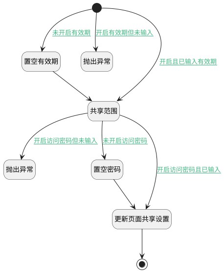

## 共享设置 <!-- {docsify-ignore-all} -->

   共享设置

### 处理过程

### 处理步骤说明

#### 开始 :id=Begin [开始]

*- N/A*
#### 置空有效期 :id=PREPAREPARAM1 [准备参数]

1. 将`空值（NULL）` 设置给  `Default(传入变量).EXPIRATION_DATE(共享有效期)`

#### 抛出异常 :id=THROWEXCEPTION1 [抛出异常]

> [!ATTENTION|label:抛出异常|icon:fa fa-warning]
> 错误信息：未设置有效期！

#### 共享范围 :id=PREPAREPARAM2 [准备参数]

1. 将`Default(传入变量).shared_scope` 设置给  `Default(传入变量).IS_SHARED(是否开启共享)`

#### 抛出异常 :id=THROWEXCEPTION2 [抛出异常]

> [!ATTENTION|label:抛出异常|icon:fa fa-warning]
> 错误信息：未设置访问密码！

#### 置空密码 :id=PREPAREPARAM3 [准备参数]

1. 将`空值（NULL）` 设置给  `Default(传入变量).ACCESS_PASSWORD(访问密码)`

#### 更新页面共享设置 :id=DEACTION1 [实体行为]

调用实体 [共享空间(SHARED_SPACE)](module/Wiki/shared_space.md) 行为 [Update](module/Wiki/shared_space#行为) ，行为参数为`Default(传入变量)`

将执行结果返回给参数`Default(传入变量)`

#### 结束 :id=END1 [结束]

返回 `Default(传入变量)`

### 连接条件说明
#### 未开启有效期 :id=Begin-PREPAREPARAM1

(`Default(传入变量).enable_expiration` ISNULL OR `Default(传入变量).enable_expiration` EQ `0`)
#### 未开启访问密码 :id=PREPAREPARAM2-PREPAREPARAM3

(`Default(传入变量).enable_password` EQ `0` OR `Default(传入变量).enable_password` ISNULL)
#### 开启访问密码且已输入 :id=PREPAREPARAM2-DEACTION1

`Default(传入变量).enable_password` EQ `1` AND `Default(传入变量).ACCESS_PASSWORD(访问密码)` ISNOTNULL
#### 开启访问密码但未输入 :id=PREPAREPARAM2-THROWEXCEPTION2

`Default(传入变量).enable_password` EQ `1` AND `Default(传入变量).ACCESS_PASSWORD(访问密码)` ISNULL
#### 开启且已输入有效期 :id=Begin-PREPAREPARAM2

`Default(传入变量).EXPIRATION_DATE(共享有效期)` ISNOTNULL AND `Default(传入变量).enable_expiration` EQ `1`
#### 开启有效期但未输入 :id=Begin-THROWEXCEPTION1

`Default(传入变量).enable_expiration` EQ `1` AND `Default(传入变量).EXPIRATION_DATE(共享有效期)` ISNULL

### 实体逻辑参数

|    中文名   |    代码名    |  数据类型    |  实体   |备注 |
| --------| --------| -------- | -------- | --------   |
|传入变量(<i class="fa fa-check"/></i>)|Default|数据对象|[共享空间(SHARED_SPACE)](module/Wiki/shared_space.md)||
