## 获取共享链接 <!-- {docsify-ignore-all} -->

   获取共享空间链接

### 处理过程

```plantuml
@startuml
hide empty description
<style>
root {
  HyperlinkColor #42b983
}
</style>

hide empty description
state "开始" as Begin <<start>> [[$./shared_url#begin {"开始"}]]
state "拼接共享链接" as RAWSFCODE1  [[$./shared_url#rawsfcode1 {"拼接共享链接"}]]
state "结束" as END1 <<end>> [[$./shared_url#end1 {"结束"}]]


Begin --> RAWSFCODE1
RAWSFCODE1 --> END1


@enduml
```




### 处理步骤说明

#### 开始 :id=Begin<sup class="footnote-symbol"> <font color=gray size=1>[开始]</font></sup>


*- N/A*
#### 拼接共享链接 :id=RAWSFCODE1<sup class="footnote-symbol"> <font color=gray size=1>[直接后台代码]</font></sup>


<p class="panel-title"><b>执行代码[Groovy]</b></p>

```groovy
def _default = logic.param('Default').getReal()
def plm_wiki = sys.param('plm_wiki','')
if(_default.get('id') != null && plm_wiki != '') {
  def _url = plm_wiki + '/plmwiki/#/-/index/-/article_page_shared_tree_exp_view/srfnavctx=%257B%2522shared_space%2522%253A%2522' + _default.get('id') + '%2522%257D'
  _default.set('shared_url', _url)
}
```

#### 结束 :id=END1<sup class="footnote-symbol"> <font color=gray size=1>[结束]</font></sup>


返回 `Default(传入变量)`


### 实体逻辑参数

|    中文名   |    代码名    |  数据类型    |  实体   |备注 |
| --------| --------| -------- | -------- | --------   |
|传入变量(<i class="fa fa-check"/></i>)|Default|数据对象|[共享空间(SHARED_SPACE)](module/Wiki/shared_space.md)||
