## 获取关联的空间 <!-- {docsify-ignore-all} -->

   

### 处理过程

```plantuml
@startuml
hide empty description
<style>
root {
  HyperlinkColor #42b983
}
</style>

hide empty description
state "开始" as Begin <<start>> [[$./get_re_space#begin {"开始"}]]
state "获取关联数据" as RAWSQLCALL1  [[$./get_re_space#rawsqlcall1 {"获取关联数据"}]]
state "执行脚本代码" as RAWSFCODE1  [[$./get_re_space#rawsfcode1 {"执行脚本代码"}]]
state "结束" as END1 <<end>> [[$./get_re_space#end1 {"结束"}]]


Begin --> RAWSQLCALL1
RAWSQLCALL1 --> RAWSFCODE1
RAWSFCODE1 --> END1


@enduml
```




### 处理步骤说明

#### 开始 :id=Begin<sup class="footnote-symbol"> <font color=gray size=1>[开始]</font></sup>


*- N/A*
#### 获取关联数据 :id=RAWSQLCALL1<sup class="footnote-symbol"> <font color=gray size=1>[直接SQL调用]</font></sup>


<p class="panel-title"><b>执行sql语句</b></p>

```sql
SELECT
	t1.ID,
	t1.`NAME`,
	t2.RELATION_TYPE 
FROM
	space t1
	JOIN relation t2 ON t2.TARGET_ID = t1.ID 
WHERE
	t1.IS_DELETED = 0 
	AND t1.IS_ARCHIVED = 0 
	AND t2.PRINCIPAL_TYPE = ? 
	AND t2.TARGET_TYPE = ? 
	AND t2.PRINCIPAL_ID = ?;
```

<p class="panel-title"><b>执行sql参数</b></p>

1. `Default(传入变量).principal_type`
2. `Default(传入变量).target_type`
3. `Default(传入变量).principal_id`

重置参数`page(page)`，并将执行sql结果赋值给参数`page(page)`

#### 执行脚本代码 :id=RAWSFCODE1<sup class="footnote-symbol"> <font color=gray size=1>[直接后台代码]</font></sup>


<p class="panel-title"><b>执行代码[Groovy]</b></p>

```groovy
def page = logic.param('page').getReal()

page.each { item ->
    if (item.get('relation_type') == 'main_space') {
        item.set('user_tag', '<?xml version="1.0" encoding="UTF-8"?><svg xmlns="http://www.w3.org/2000/svg" viewBox="0 0 20 20" class="design-iconfont" width="20" height="20"><title>֪主知识库</title><path d="M17.5,15 L5,15 C4.53976667,15 4.16666667,15.3730833 4.16666667,15.8333333 C4.16666667,16.2935833 4.53976667,16.6666667 5,16.6666667 L17.5,16.6666667 L17.5,18.3333333 L5,18.3333333 C3.61929167,18.3333333 2.5,17.2140833 2.5,15.8333333 L2.5,3.33333333 C2.5,2.41285833 3.24619167,1.66666667 4.16666667,1.66666667 L17.5,1.66666667 L17.5,15 Z M13.3333333,7.5 L13.3333333,5.83333333 L6.66666667,5.83333333 L6.66666667,7.5 L13.3333333,7.5 Z" fill="orange" fill-rule="nonzero"></path></svg>')
    } else {
        item.set('user_tag', '<?xml version="1.0" encoding="UTF-8"?><svg xmlns="http://www.w3.org/2000/svg" viewBox="0 0 20 20" class="design-iconfont" width="20" height="20"><title>֪知识库</title><path d="M17.5,15 L5,15 C4.53976667,15 4.16666667,15.3730833 4.16666667,15.8333333 C4.16666667,16.2935833 4.53976667,16.6666667 5,16.6666667 L17.5,16.6666667 L17.5,18.3333333 L5,18.3333333 C3.61929167,18.3333333 2.5,17.2140833 2.5,15.8333333 L2.5,3.33333333 C2.5,2.41285833 3.24619167,1.66666667 4.16666667,1.66666667 L17.5,1.66666667 L17.5,15 Z M13.3333333,7.5 L13.3333333,5.83333333 L6.66666667,5.83333333 L6.66666667,7.5 L13.3333333,7.5 Z" fill="#56ABFB" fill-rule="nonzero"></path></svg>')
    }
}
```

#### 结束 :id=END1<sup class="footnote-symbol"> <font color=gray size=1>[结束]</font></sup>


返回 `page`


### 实体逻辑参数

|    中文名   |    代码名    |  数据类型    |  实体   |备注 |
| --------| --------| -------- | -------- | --------   |
|传入变量(<i class="fa fa-check"/></i>)|Default|过滤器|||
|page|page|数据对象列表|[空间(SPACE)](module/Wiki/space.md)||
