## 标记主空间 <!-- {docsify-ignore-all} -->

   

### 处理过程

```plantuml
@startuml
hide empty description
<style>
root {
  HyperlinkColor #42b983
}
</style>

hide empty description
state "开始" as Begin <<start>> [[$./mark_main_space#begin {"开始"}]]
state "清除主标记" as RAWSQLCALL1  [[$./mark_main_space#rawsqlcall1 {"清除主标记"}]]
state "标记主知识库" as RAWSQLCALL2  [[$./mark_main_space#rawsqlcall2 {"标记主知识库"}]]
state "结束" as END1 <<end>> [[$./mark_main_space#end1 {"结束"}]]


Begin --> RAWSQLCALL1
RAWSQLCALL1 --> RAWSQLCALL2
RAWSQLCALL2 --> END1


@enduml
```




### 处理步骤说明

#### 开始 :id=Begin<sup class="footnote-symbol"> <font color=gray size=1>[开始]</font></sup>


*- N/A*
#### 清除主标记 :id=RAWSQLCALL1<sup class="footnote-symbol"> <font color=gray size=1>[直接SQL调用]</font></sup>


<p class="panel-title"><b>执行sql语句</b></p>

```sql
UPDATE relation
SET RELATION_TYPE = NULL
WHERE PRINCIPAL_ID = ? AND (PRINCIPAL_TYPE = 'project' OR PRINCIPAL_TYPE = 'product') AND TARGET_TYPE = 'space';
```

<p class="panel-title"><b>执行sql参数</b></p>

1. `Default(传入变量).principal_id`


#### 标记主知识库 :id=RAWSQLCALL2<sup class="footnote-symbol"> <font color=gray size=1>[直接SQL调用]</font></sup>


<p class="panel-title"><b>执行sql语句</b></p>

```sql
UPDATE relation
SET RELATION_TYPE = 'main_space'
WHERE PRINCIPAL_ID = ? AND TARGET_ID = ? AND (PRINCIPAL_TYPE = 'project' OR PRINCIPAL_TYPE = 'product') AND TARGET_TYPE = 'space';
```

<p class="panel-title"><b>执行sql参数</b></p>

1. `Default(传入变量).principal_id`
2. `Default(传入变量).ID(标识)`


#### 结束 :id=END1<sup class="footnote-symbol"> <font color=gray size=1>[结束]</font></sup>


*- N/A*


### 实体逻辑参数

|    中文名   |    代码名    |  数据类型    |  实体   |备注 |
| --------| --------| -------- | -------- | --------   |
|传入变量(<i class="fa fa-check"/></i>)|Default|数据对象|[空间(SPACE)](module/Wiki/space.md)||
