## 移出分类 <!-- {docsify-ignore-all} -->

   将空间移除分类

### 处理过程

```plantuml
@startuml
hide empty description
<style>
root {
  HyperlinkColor #42b983
}
</style>

hide empty description
state "开始" as Begin <<start>> [[$./move_out_category#begin {"开始"}]]
state "置空分类属性值" as PREPAREPARAM1  [[$./move_out_category#prepareparam1 {"置空分类属性值"}]]
state "修改空间" as DEACTION1  [[$./move_out_category#deaction1 {"修改空间"}]]
state "结束" as END1 <<end>> [[$./move_out_category#end1 {"结束"}]]


Begin --> PREPAREPARAM1
PREPAREPARAM1 --> DEACTION1
DEACTION1 --> END1


@enduml
```

### 处理步骤说明

#### 开始 :id=Begin [开始]

*- N/A*
#### 置空分类属性值 :id=PREPAREPARAM1 [准备参数]

1. 将`空值（NULL）` 设置给  `Default(传入变量).CATEGORY_ID(分类)`
2. 将`空值（NULL）` 设置给  `Default(传入变量).CATEGORY_NAME(分类)`
3. 将`空值（NULL）` 设置给  `Default(传入变量).CATEGORIES(分类路径)`

#### 修改空间 :id=DEACTION1 [实体行为]

调用实体 [空间(SPACE)](module/Wiki/space.md) 行为 [Update](module/Wiki/space#行为) ，行为参数为`Default(传入变量)`

#### 结束 :id=END1 [结束]

*- N/A*

### 实体逻辑参数

|    中文名   |    代码名    |  数据类型    |  实体   |备注 |
| --------| --------| -------- | -------- | --------   |
|传入变量(<i class="fa fa-check"/></i>)|Default|数据对象|[空间(SPACE)](module/Wiki/space.md)||
|循环临时变量|for_temp_obj|数据对象|[空间(SPACE)](module/Wiki/space.md)||
|所选空间列表|srfactionparam|数据对象列表|[空间(SPACE)](module/Wiki/space.md)||
