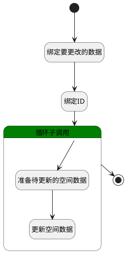

## 移动空间 <!-- {docsify-ignore-all} -->

   更新空间的所属、可见范围

### 处理过程

### 处理步骤说明

#### 开始 :id=Begin [开始]

*- N/A*
#### 绑定要更改的数据 :id=BINDPARAM1 [绑定参数]

绑定参数`Default(传入变量)` 到 `srfactionparam(更改的数据)`
#### 绑定ID :id=BINDPARAM2 [绑定参数]

绑定参数`Default(传入变量)` 到 `id(主键)`
#### 结束 :id=END1 [结束]

*- N/A*

#### 循环子调用 :id=LOOPSUBCALL1 [循环子调用]

循环参数`srfactionparam(更改的数据)`，子循环参数使用`for_temp(循环变量)`
#### 准备待更新的空间数据 :id=PREPAREPARAM1 [准备参数]

1. 将`id(主键)` 设置给  `temp_space(临时空间).ID(标识)`
2. 将`for_temp(循环变量).SCOPE_ID(所属对象)` 设置给  `temp_space(临时空间).SCOPE_ID(所属对象)`
3. 将`for_temp(循环变量).SCOPE_TYPE(所属)` 设置给  `temp_space(临时空间).SCOPE_TYPE(所属)`
4. 将`for_temp(循环变量).VISIBILITY(可见范围)` 设置给  `temp_space(临时空间).VISIBILITY(可见范围)`

#### 更新空间数据 :id=DEACTION1 [实体行为]

调用实体 [空间(SPACE)](module/Wiki/space.md) 行为 [Update](module/Wiki/space#行为) ，行为参数为`temp_space(临时空间)`

### 实体逻辑参数

|    中文名   |    代码名    |  数据类型    |  实体   |备注 |
| --------| --------| -------- | -------- | --------   |
|传入变量(<i class="fa fa-check"/></i>)|Default|数据对象|[空间(SPACE)](module/Wiki/space.md)||
|循环变量|for_temp|数据对象|[空间(SPACE)](module/Wiki/space.md)||
|主键|id|简单数据|||
|更改的数据|srfactionparam|数据对象列表|[空间(SPACE)](module/Wiki/space.md)||
|临时空间|temp_space|数据对象|[空间(SPACE)](module/Wiki/space.md)||
