## 开启共享 <!-- {docsify-ignore-all} -->

   空间开启共享

### 处理过程

```plantuml
@startuml
hide empty description
<style>
root {
  HyperlinkColor #42b983
}
</style>

hide empty description
state "开始" as Begin <<start>> [[$./open_shared#begin {"开始"}]]
state "设置默认共享状态" as PREPAREPARAM1  [[$./open_shared#prepareparam1 {"设置默认共享状态"}]]
state "填充共享时间" as RAWSFCODE1  [[$./open_shared#rawsfcode1 {"填充共享时间"}]]
state "开启共享" as DEACTION1  [[$./open_shared#deaction1 {"开启共享"}]]
state "结束" as END1 <<end>> [[$./open_shared#end1 {"结束"}]]


Begin --> PREPAREPARAM1
PREPAREPARAM1 --> RAWSFCODE1
RAWSFCODE1 --> DEACTION1
DEACTION1 --> END1


@enduml
```




### 处理步骤说明

#### 开始 :id=Begin<sup class="footnote-symbol"> <font color=gray size=1>[开始]</font></sup>


*- N/A*
#### 设置默认共享状态 :id=PREPAREPARAM1<sup class="footnote-symbol"> <font color=gray size=1>[准备参数]</font></sup>


1. 将`1` 设置给  `shared_space(共享空间).IS_SHARED(是否开启共享)`
2. 将`Default(传入变量).ID(标识)` 设置给  `shared_space(共享空间).ID(标识)`
3. 将`用户全局对象.srfpersonid` 设置给  `shared_space(共享空间).SHARED_BY(共享人)`

#### 填充共享时间 :id=RAWSFCODE1<sup class="footnote-symbol"> <font color=gray size=1>[直接后台代码]</font></sup>


<p class="panel-title"><b>执行代码[Groovy]</b></p>

```groovy
def _shared_space = logic.param('shared_space').getReal()
if(_shared_space.get('shared_time') == null){
    _shared_space.set('shared_time', new java.sql.Timestamp(System.currentTimeMillis()))
}
```

#### 开启共享 :id=DEACTION1<sup class="footnote-symbol"> <font color=gray size=1>[实体行为]</font></sup>


调用实体 [共享空间(SHARED_SPACE)](module/Wiki/shared_space.md) 行为 [Update](module/Wiki/shared_space#行为) ，行为参数为`shared_space(共享空间)`

将执行结果返回给参数`shared_space(共享空间)`

#### 结束 :id=END1<sup class="footnote-symbol"> <font color=gray size=1>[结束]</font></sup>


*- N/A*


### 实体逻辑参数

|    中文名   |    代码名    |  数据类型    |  实体   |备注 |
| --------| --------| -------- | -------- | --------   |
|传入变量(<i class="fa fa-check"/></i>)|Default|数据对象|[空间(SPACE)](module/Wiki/space.md)||
|共享空间|shared_space|数据对象|[共享空间(SHARED_SPACE)](module/Wiki/shared_space.md)||
