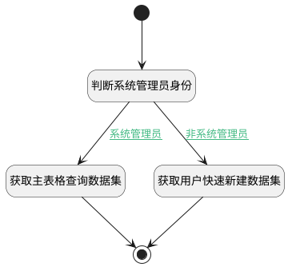

## 获取快速新建空间集合 <!-- {docsify-ignore-all} -->

   用于获取可快速新建的空间集合

### 处理过程




### 处理步骤说明

#### 开始 :id=Begin<sup class="footnote-symbol"> <font color=gray size=1>[开始]</font></sup>


*- N/A*
#### 判断系统管理员身份 :id=RAWSFCODE3<sup class="footnote-symbol"> <font color=gray size=1>[直接后台代码]</font></sup>


<p class="panel-title"><b>执行代码[Groovy]</b></p>

```groovy
def _usercontext = sys.user();
def srfreadonly = _usercontext.testSysUniRes("SYSTEM");
def _default = logic.param("default").real;
if(srfreadonly == true){
    _default.set("srfreadonly",false);
}
```

#### 获取主表格查询数据集 :id=DEDATASET2<sup class="footnote-symbol"> <font color=gray size=1>[实体数据集]</font></sup>


调用实体 [空间(SPACE)](module/Wiki/space.md) 数据集合 [主表格查询(main)](module/Wiki/space#数据集合) ，查询参数为`Default(传入变量)`

将执行结果返回给参数`spaces`

#### 获取用户快速新建数据集 :id=DEDATASET4<sup class="footnote-symbol"> <font color=gray size=1>[实体数据集]</font></sup>


调用实体 [空间(SPACE)](module/Wiki/space.md) 数据集合 [快速新建查询（管理用户）(quick_user)](module/Wiki/space#数据集合) ，查询参数为`Default(传入变量)`

将执行结果返回给参数`spaces`

#### 结束 :id=END2<sup class="footnote-symbol"> <font color=gray size=1>[结束]</font></sup>


返回 `spaces`


### 连接条件说明
#### 非系统管理员 :id=RAWSFCODE3-DEDATASET4

`Default(传入变量).srfreadonly` ISNULL
#### 系统管理员 :id=RAWSFCODE3-DEDATASET2

`Default(传入变量).srfreadonly` EQ `false`


### 实体逻辑参数

|    中文名   |    代码名    |  数据类型    |  实体   |备注 |
| --------| --------| -------- | -------- | --------   |
|传入变量(<i class="fa fa-check"/></i>)|Default|过滤器|||
|spaces|spaces|分页查询|||
