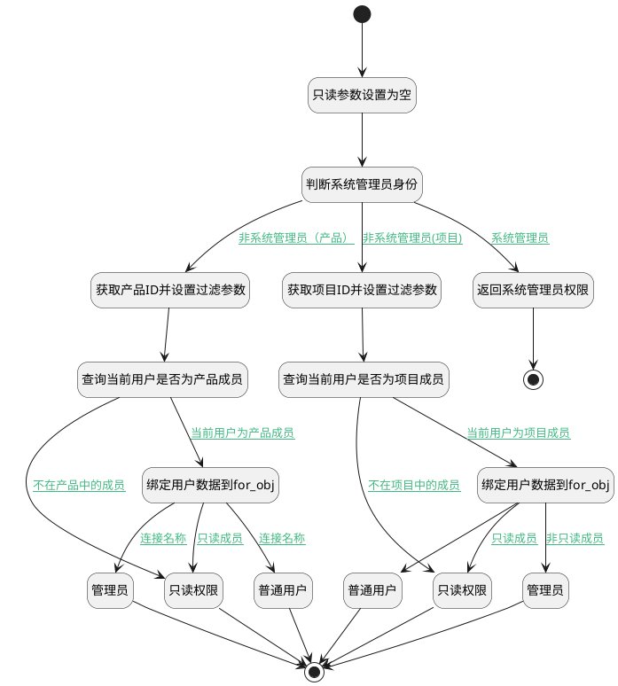

## 判断当前用户角色 <!-- {docsify-ignore-all} -->

   判断当前用户角色

### 处理过程




### 处理步骤说明

#### 管理员 :id=RAWSFCODE2<sup class="footnote-symbol"> <font color=gray size=1>[直接后台代码]</font></sup>


<p class="panel-title"><b>执行代码[JavaScript]</b></p>

```javascript
var defaultObj = logic.getParam("default");
defaultObj.set("srfreadonly", false);
defaultObj.set("user_role", "admin");
```

#### 绑定用户数据到for_obj :id=PREPAREPARAM5<sup class="footnote-symbol"> <font color=gray size=1>[准备参数]</font></sup>


1. 将`members(成员).0` 绑定给  `for_obj(循环临时变量)`

#### 普通用户 :id=RAWSFCODE7<sup class="footnote-symbol"> <font color=gray size=1>[直接后台代码]</font></sup>


<p class="panel-title"><b>执行代码[JavaScript]</b></p>

```javascript
var defaultObj = logic.getParam("default");
defaultObj.set("srfreadonly", false);
defaultObj.set("user_role", "user");
```

#### 获取项目ID并设置过滤参数 :id=PREPAREPARAM2<sup class="footnote-symbol"> <font color=gray size=1>[准备参数]</font></sup>


1. 将`Default(传入变量).project` 设置给  `project_filter(项目过滤器).N_PROJECT_ID_EQ`
2. 将`用户全局对象.srfpersonid` 设置给  `project_filter(项目过滤器).N_USER_ID_EQ`

#### 查询当前用户是否为项目成员 :id=DEDATASET3<sup class="footnote-symbol"> <font color=gray size=1>[实体数据集]</font></sup>


调用实体 [项目成员(PROJECT_MEMBER)](module/ProjMgmt/project_member.md) 数据集合 [数据集(DEFAULT)](module/ProjMgmt/project_member#数据集合) ，查询参数为`project_filter(项目过滤器)`

将执行结果返回给参数`members(成员)`

#### 只读权限 :id=RAWSFCODE1<sup class="footnote-symbol"> <font color=gray size=1>[直接后台代码]</font></sup>


<p class="panel-title"><b>执行代码[JavaScript]</b></p>

```javascript
var defaultObj = logic.getParam("default");

defaultObj.set("srfreadonly", true);
defaultObj.set("user_role", "reader");
```

#### 开始 :id=Begin<sup class="footnote-symbol"> <font color=gray size=1>[开始]</font></sup>


*- N/A*
#### 只读参数设置为空 :id=PREPAREPARAM4<sup class="footnote-symbol"> <font color=gray size=1>[准备参数]</font></sup>


1. 将`空值（NULL）` 设置给  `Default(传入变量).srfreadonly`

#### 判断系统管理员身份 :id=RAWSFCODE3<sup class="footnote-symbol"> <font color=gray size=1>[直接后台代码]</font></sup>


<p class="panel-title"><b>执行代码[Groovy]</b></p>

```groovy
def _usercontext = sys.user();
def srfreadonly = _usercontext.testSysUniRes("SYSTEM");
def _default = logic.param("default").real;
if(srfreadonly == true){
    _default.set("srfreadonly",false);
}
```

#### 结束 :id=END6<sup class="footnote-symbol"> <font color=gray size=1>[结束]</font></sup>


返回 `Default(传入变量)`

#### 获取产品ID并设置过滤参数 :id=PREPAREPARAM6<sup class="footnote-symbol"> <font color=gray size=1>[准备参数]</font></sup>


1. 将`Default(传入变量).product` 设置给  `product_filter(产品过滤器).N_PRODUCT_ID_EQ`
2. 将`用户全局对象.srfpersonid` 设置给  `product_filter(产品过滤器).N_USER_ID_EQ`

#### 查询当前用户是否为产品成员 :id=DEDATASET2<sup class="footnote-symbol"> <font color=gray size=1>[实体数据集]</font></sup>


调用实体 [产品成员(PRODUCT_MEMBER)](module/ProdMgmt/product_member.md) 数据集合 [数据集(DEFAULT)](module/ProdMgmt/product_member#数据集合) ，查询参数为`product_filter(产品过滤器)`

将执行结果返回给参数`members(成员)`

#### 只读权限 :id=RAWSFCODE4<sup class="footnote-symbol"> <font color=gray size=1>[直接后台代码]</font></sup>


<p class="panel-title"><b>执行代码[JavaScript]</b></p>

```javascript
var defaultObj = logic.getParam("default");
defaultObj.set("srfreadonly", true);
defaultObj.set("user_role", "reader");
```

#### 返回系统管理员权限 :id=PREPAREPARAM3<sup class="footnote-symbol"> <font color=gray size=1>[准备参数]</font></sup>


1. 将`sys_admin` 设置给  `Default(传入变量).user_role`

#### 结束 :id=END2<sup class="footnote-symbol"> <font color=gray size=1>[结束]</font></sup>


返回 `Default(传入变量)`

#### 普通用户 :id=RAWSFCODE6<sup class="footnote-symbol"> <font color=gray size=1>[直接后台代码]</font></sup>


<p class="panel-title"><b>执行代码[JavaScript]</b></p>

```javascript
var defaultObj = logic.getParam("default");
defaultObj.set("srfreadonly", false);
defaultObj.set("user_role", "user");
```

#### 绑定用户数据到for_obj :id=PREPAREPARAM7<sup class="footnote-symbol"> <font color=gray size=1>[准备参数]</font></sup>


1. 将`members(成员).0` 绑定给  `for_obj(循环临时变量)`

#### 管理员 :id=RAWSFCODE5<sup class="footnote-symbol"> <font color=gray size=1>[直接后台代码]</font></sup>


<p class="panel-title"><b>执行代码[JavaScript]</b></p>

```javascript
var defaultObj = logic.getParam("default");
defaultObj.set("srfreadonly", false);
defaultObj.set("user_role", "admin");
```


### 连接条件说明
#### 非系统管理员(项目) :id=RAWSFCODE3-PREPAREPARAM2

`Default(传入变量).srfreadonly` ISNULL AND `Default(传入变量).project` ISNOTNULL
#### 不在项目中的成员 :id=DEDATASET3-RAWSFCODE1

`members(成员).size` EQ `0`
#### 当前用户为项目成员 :id=DEDATASET3-PREPAREPARAM5

`members(成员).size` EQ `1`
#### 非只读成员 :id=PREPAREPARAM5-RAWSFCODE2

`for_obj(循环临时变量).role_id` EQ `admin`
#### 只读成员 :id=PREPAREPARAM5-RAWSFCODE1

`for_obj(循环临时变量).role_id` EQ `reader`
#### 系统管理员 :id=RAWSFCODE3-PREPAREPARAM3

`Default(传入变量).srfreadonly` EQ `false`
#### 非系统管理员（产品） :id=RAWSFCODE3-PREPAREPARAM6

`Default(传入变量).product` ISNOTNULL AND `Default(传入变量).srfreadonly` ISNULL
#### 当前用户为产品成员 :id=DEDATASET2-PREPAREPARAM7

`members(成员).size` EQ `1`
#### 连接名称 :id=PREPAREPARAM7-RAWSFCODE5

`for_obj(循环临时变量).ROLE_ID` EQ `admin`
#### 连接名称 :id=PREPAREPARAM7-RAWSFCODE6

`for_obj(循环临时变量).ROLE_ID` EQ `user`
#### 只读成员 :id=PREPAREPARAM7-RAWSFCODE4

`for_obj(循环临时变量).ROLE_ID` EQ `reader`
#### 不在产品中的成员 :id=DEDATASET2-RAWSFCODE4

`members(成员).size` EQ `0`


### 实体逻辑参数

|    中文名   |    代码名    |  数据类型    |  实体   |备注 |
| --------| --------| -------- | -------- | --------   |
|传入变量(<i class="fa fa-check"/></i>)|Default|数据对象|[空间(SPACE)](module/Wiki/space.md)||
|循环临时变量|for_obj|数据对象|||
|成员|members|分页查询|||
|产品过滤器|product_filter|过滤器|||
|项目过滤器|project_filter|过滤器|||
|当前登录人|user|数据对象|||
