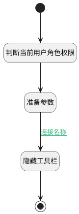

## 判断当前用户角色（关联） <!-- {docsify-ignore-all} -->

   产品/项目中的页面组件下，判断进入的用户角色

### 处理过程




### 处理步骤说明

#### 开始 :id=Begin<sup class="footnote-symbol"> <font color=gray size=1>[开始]</font></sup>


#### 结束 :id=END1<sup class="footnote-symbol"> <font color=gray size=1>[结束]</font></sup>


#### 判断当前用户角色权限 :id=DEACTION1<sup class="footnote-symbol"> <font color=gray size=1>[实体行为]</font></sup>


调用实体 [空间(SPACE)](module/Wiki/space.md) 行为 [判断当前用户角色(recognize_cur_user_role)](module/Wiki/space#行为) ，行为参数为`ctx(上下文)`

将执行结果返回给参数`ctx(上下文)`

#### 准备参数 :id=PREPAREJSPARAM1<sup class="footnote-symbol"> <font color=gray size=1>[准备参数]</font></sup>


1. 将`ctx(上下文).user_role` 设置给  `view(当前视图).context.user_role`

#### 隐藏工具栏 :id=RAWJSCODE1<sup class="footnote-symbol"> <font color=gray size=1>[直接前台代码]</font></sup>


<p class="panel-title"><b>执行代码</b></p>

```javascript
uiLogic.treeexpbar.layoutPanel.panelItems.control_toolbar.state.visible=false;

```

### 连接条件说明
#### 连接名称 :id=PREPAREJSPARAM1-RAWJSCODE1

(```ctx(上下文).user_role``` EQ ```reader``` OR ```ctx(上下文).user_role``` EQ ```user```)


### 实体逻辑参数

|    中文名   |    代码名    |  数据类型      |备注 |
| --------| --------| --------  | --------   |
|上下文|ctx|导航视图参数绑定参数||
|传入变量(<i class="fa fa-check"/></i>)|Default|数据对象||
|当前视图|view|当前视图对象||
|树|treeexpbar|部件对象||
