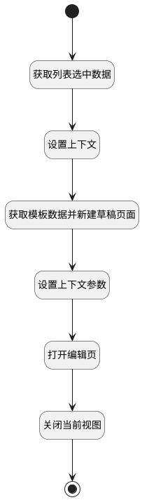

## 打开新建页面并关闭模板中心 <!-- {docsify-ignore-all} -->

   打开新建页并关闭模板中心

### 处理过程




### 处理步骤说明

#### 开始 :id=Begin<sup class="footnote-symbol"> <font color=gray size=1>[开始]</font></sup>


#### 设置上下文 :id=RAWJSCODE1<sup class="footnote-symbol"> <font color=gray size=1>[直接前台代码]</font></sup>


<p class="panel-title"><b>执行代码</b></p>

```javascript
if(uiLogic.selecteddata && uiLogic.selecteddata.length >0){
    uiLogic.context.stencil_id = uiLogic.selecteddata[0].id;
    uiLogic.stencil_info = uiLogic.selecteddata[0];
    uiLogic.stencil_info.space_id = uiLogic.context.stencil_space;

}
```

#### 结束 :id=END1<sup class="footnote-symbol"> <font color=gray size=1>[结束]</font></sup>


#### 获取列表选中数据 :id=PREPAREJSPARAM1<sup class="footnote-symbol"> <font color=gray size=1>[准备参数]</font></sup>


1. 将`listexpbar(列表).xDataController.state.selectedData` 绑定给  `selecteddata(选中数据)`

#### 获取模板数据并新建草稿页面 :id=DEACTION1<sup class="footnote-symbol"> <font color=gray size=1>[实体行为]</font></sup>


调用实体 [页面模板(STENCIL)](module/Wiki/stencil.md) 行为 [根据模板新建草稿(new_draft_form_stencil)](module/Wiki/stencil#行为) ，行为参数为`stencil_info(模板信息)`

将执行结果返回给参数`page_info(新建页面信息)`

#### 设置上下文参数 :id=PREPAREJSPARAM2<sup class="footnote-symbol"> <font color=gray size=1>[准备参数]</font></sup>


1. 将`context(视图上下文).stencil_space` 设置给  `context(视图上下文).space`

#### 打开编辑页 :id=DEUIACTION1<sup class="footnote-symbol"> <font color=gray size=1>[实体界面行为调用]</font></sup>


调用实体 [页面(PAGE)](module/Wiki/article_page.md) 界面行为 [从模板新建（打开从模板新建视图）](module/Wiki/article_page#界面行为) ，行为参数为`page_info(新建页面信息)`

#### 关闭当前视图 :id=RAWJSCODE2<sup class="footnote-symbol"> <font color=gray size=1>[直接前台代码]</font></sup>


<p class="panel-title"><b>执行代码</b></p>

```javascript
view.state.isLoading = false;
view.closeView();

```


### 实体逻辑参数

|    中文名   |    代码名    |  数据类型      |备注 |
| --------| --------| --------  | --------   |
|模板信息|stencil_info|数据对象||
|视图|view|当前视图对象||
|传入变量(<i class="fa fa-check"/></i>)|Default|数据对象||
|新建页面信息|page_info|数据对象||
|列表|listexpbar|部件对象||
|选中数据|selecteddata|数据对象列表||
|视图上下文|context|导航视图参数绑定参数||
