## 发布 <!-- {docsify-ignore-all} -->

   

### 处理过程

```plantuml
@startuml
hide footbox
<style>
root {
  HyperlinkColor #42b983
}
</style>

hide empty description
state "开始" as Begin <<start>> [[$./release#begin {开始}]]
state "获取表单数据" as RAWJSCODE_01  [[$./release#rawjscode_01 {获取表单数据}]]
state "准备参数" as PREPAREJSPARAM_01  [[$./release#preparejsparam_01 {准备参数}]]
state "发布" as DEACTION_01  [[$./release#deaction_01 {发布}]]


Begin --> PREPAREJSPARAM_01
PREPAREJSPARAM_01 --> RAWJSCODE_01
RAWJSCODE_01 --> DEACTION_01


@enduml
```




### 处理步骤说明

#### 开始 :id=Begin<sup class="footnote-symbol"> <font color=gray size=1>[开始]</font></sup>


#### 准备参数 :id=PREPAREJSPARAM_01<sup class="footnote-symbol"> <font color=gray size=1>[准备参数]</font></sup>


1. 将`Default(传入变量)` 拷贝到  `stencil`

#### 获取表单数据 :id=RAWJSCODE_01<sup class="footnote-symbol"> <font color=gray size=1>[直接前台代码]</font></sup>


<p class="panel-title"><b>执行代码</b></p>

```javascript
// uiLogic.stencil = view.layoutPanel.panelItems.form.control.getReal()[0];

const stencil = uiLogic.stencil;

console.info(stencil);

if(stencil.format_type === "HTML"  &&  stencil.html_description !== undefined){
    stencil.content = stencil.html_description;
}
if(stencil.format_type === "MD"  &&  stencil.md_description !== undefined){
    stencil.content = stencil.md_description;
}
if(stencil.format_type === "EXCEL" &&  stencil.excel_description !== undefined){
    stencil.content = stencil.excel_description;
}


```

#### 发布 :id=DEACTION_01<sup class="footnote-symbol"> <font color=gray size=1>[实体行为]</font></sup>


调用实体 [页面模板(STENCIL)](module/Wiki/stencil.md) 行为 [Save](module/Wiki/stencil#行为) ，行为参数为`stencil`


### 实体逻辑参数

|    中文名   |    代码名    |  数据类型      |备注 |
| --------| --------| --------  | --------   |
|传入变量(<i class="fa fa-check"/></i>)|Default|数据对象||
|stencil|stencil|数据对象||
