## run分配智能体逻辑 <!-- {docsify-ignore-all} -->

   

### 处理过程

```plantuml
@startuml
hide footbox
<style>
root {
  HyperlinkColor #42b983
}
</style>

hide empty description
state "开始" as Begin <<start>> [[$./run#begin {开始}]]
state "注入脚本代码" as RAWJSCODE_01  [[$./run#rawjscode_01 {注入脚本代码}]]
state "界面行为" as DEUIACTION_01  [[$./run#deuiaction_01 {界面行为}]]


Begin --> RAWJSCODE_01
RAWJSCODE_01 --> DEUIACTION_01


@enduml
```




### 处理步骤说明

#### 开始 :id=Begin<sup class="footnote-symbol"> <font color=gray size=1>[开始]</font></sup>


#### 注入脚本代码 :id=RAWJSCODE_01<sup class="footnote-symbol"> <font color=gray size=1>[直接前台代码]</font></sup>


<p class="panel-title"><b>执行代码</b></p>

```javascript
console.log("执行智能体");
 Object.assign(uiLogic.aicontext, uiLogic.default);
uiLogic.aicontext._name=uiLogic.aicontext.name;
uiLogic.aicontext.srfmajortext = uiLogic.aicontext.name;
const screenshot = uiLogic.aicontext.description && uiLogic.aicontext.description.indexOf("截图")>=0
uiLogic.context.ai_agent_context=uiLogic.aicontext.context_id;
if(view && view.parentView) {
    
    const appDataEntityId=view.parentView.model.appDataEntityId;
    if(appDataEntityId && appDataEntityId.indexOf(".")>0) {
        uiLogic.aicontext._entity_tag=appDataEntityId.split(".")[1];
        uiLogic.context._entity_tag=uiLogic.aicontext._entity_tag;
    }
    var contextObj = view.parentView.state.srfactiveviewdata;
    if((!contextObj) && view.parentData && view.parentData.length > 0) {
        if (view.parentData.length == 1) {
            contextObj = view.parentData[0];
        }
        else {
            contextObj = view.parentData;
        }
    }
    else if((!contextObj) && view.parentView.getController("form")) {
        contextObj = view.parentView.getController("form").data;
    }
    if(contextObj) {
        // 使用Object.assign进行浅合并
        if (!Array.isArray(contextObj)) {
            Object.assign(uiLogic.aicontext, contextObj);
        }
        else {
            uiLogic.aicontext.list = contextObj;
        }
    }
     
    if(screenshot) {
        try{

            const viewDom = document.getElementById(view.parentView.id);
            if (viewDom) {
                const fileName = view.parentView.model.caption || view.parentView.model.codeName;
                const screenshotElement = document.querySelector('.priority-screenshot') || 
                          document.querySelector('.ibiz-bi-report-panel-content>.el-collapse') || 
                          document.querySelector('.ibiz-custom-dashboard-container') || 
                          viewDom;
                
                const canvas = await ibiz.util.html2canvas.getCanvas(screenshotElement, { fileName });

                const blob = await new Promise((resolve) => {
                    canvas.toBlob((b) => {
                        if (b) {
                             const file = new File([b], fileName + '.png', {
                                type: 'image/png',
                                lastModified: new Date().getTime()
                            });
                            resolve(file);
                        } else {
                            resolve(null);
                        }
                    }, 'image/png', 0.7);
                });

                const fileUrlObj = ibiz.util.file.calcFileUpDownUrl(view.parentView.context,view.parentView.params);
                const fileobj = await ibiz.util.file.fileUpload(fileUrlObj.uploadUrl,blob,ibiz.util.file.getUploadHeaders());

                uiLogic.aicontext.screenshot="+")";
                
                
            }

         } catch (error) {
        }
        
    }
}
```

#### 界面行为 :id=DEUIACTION_01<sup class="footnote-symbol"> <font color=gray size=1>[实体界面行为调用]</font></sup>


调用实体 [智能体会话(AI_AGENT_SESSION)](module/ai/ai_agent_session.md) 界面行为 [执行逻辑](module/ai/ai_agent_session#界面行为) ，行为参数为`aicontext`


### 实体逻辑参数

|    中文名   |    代码名    |  数据类型      |备注 |
| --------| --------| --------  | --------   |
|context|context|导航视图参数绑定参数||
|aicontext|aicontext|数据对象||
|传入变量(<i class="fa fa-check"/></i>)|Default|数据对象||
