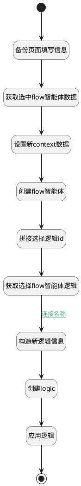

## agent_flow_clone <!-- {docsify-ignore-all} -->

   克隆flow智能体

### 处理过程




### 处理步骤说明

#### 开始 :id=Begin<sup class="footnote-symbol"> <font color=gray size=1>[开始]</font></sup>


*- N/A*
#### 备份页面填写信息 :id=PREPAREPARAM_02<sup class="footnote-symbol"> <font color=gray size=1>[准备参数]</font></sup>


1. 将`Default(传入变量).CODE_NAME(代码标识)` 设置给  `clone_ag_context2.CODE_NAME(代码标识)`
2. 将`Default(传入变量).NAME(名称)` 设置给  `clone_ag_context2.NAME(名称)`

#### 获取选中flow智能体数据 :id=DEACTION_01<sup class="footnote-symbol"> <font color=gray size=1>[实体行为]</font></sup>


调用实体 [智能体业务上下文(AI_AGENT_CONTEXT)](module/ai/ai_agent_context.md) 行为 [Get](module/ai/ai_agent_context#行为) ，行为参数为`Default(传入变量)`

将执行结果返回给参数`original_ag_context`

#### 设置新context数据 :id=PREPAREPARAM_01<sup class="footnote-symbol"> <font color=gray size=1>[准备参数]</font></sup>


1. 将`空值（NULL）` 设置给  `original_ag_context.ID(智能体业务上下文标识)`
2. 将`clone_ag_context2.NAME(名称)` 设置给  `original_ag_context.NAME(名称)`
3. 将`original_ag_context.CODE_NAME(代码标识)` 设置给  `clone_ag_context1.CODE_NAME(代码标识)`
4. 将`clone_ag_context2.CODE_NAME(代码标识)` 设置给  `original_ag_context.CODE_NAME(代码标识)`

#### 创建flow智能体 :id=DEACTION_02<sup class="footnote-symbol"> <font color=gray size=1>[实体行为]</font></sup>


调用实体 [智能体业务上下文(AI_AGENT_CONTEXT)](module/ai/ai_agent_context.md) 行为 [Create](module/ai/ai_agent_context#行为) ，行为参数为`original_ag_context`

#### 创建logic :id=DEACTION_04<sup class="footnote-symbol"> <font color=gray size=1>[实体行为]</font></sup>


调用实体 [实体处理逻辑(PSDELOGIC)](module/extension/PSDELogic.md) 行为 [Create](module/extension/PSDELogic#行为) ，行为参数为`original_delogic`

将执行结果返回给参数`original_delogic`

#### 构造新逻辑信息 :id=RAWSFCODE_03<sup class="footnote-symbol"> <font color=gray size=1>[直接后台代码]</font></sup>


<p class="panel-title"><b>执行代码[Groovy]</b></p>

```groovy
def _original_delogic = logic.param('original_delogic').getReal();
def _clone_ag_context2 = logic.param('clone_ag_context2').getReal()
_original_delogic.id=_clone_ag_context2.code_name+ "@ai.AI_AGENT_CONTEXT.agent_flow_templ"
_original_delogic.psdeid=_clone_ag_context2.code_name+ "@ai.AI_AGENT_CONTEXT"
println("最终_original_delogic："+_original_delogic);

```

#### 获取选择flow智能体逻辑 :id=DEACTION_03<sup class="footnote-symbol"> <font color=gray size=1>[实体行为]</font></sup>


调用实体 [实体处理逻辑(PSDELOGIC)](module/extension/PSDELogic.md) 行为 [Get](module/extension/PSDELogic#行为) ，行为参数为`original_delogic`

将执行结果返回给参数`original_delogic`

#### 拼接选择逻辑id :id=RAWSFCODE_01<sup class="footnote-symbol"> <font color=gray size=1>[直接后台代码]</font></sup>


<p class="panel-title"><b>执行代码[Groovy]</b></p>

```groovy
def _clone_ag_context1 = logic.param('clone_ag_context1').getReal();
def choose_logic_id=_clone_ag_context1.code_name+ "@ai.AI_AGENT_CONTEXT.agent_flow_templ"
def _original_delogic = logic.param('original_delogic').getReal()
_original_delogic.id=choose_logic_id
println("选择的choose_logic_id："+choose_logic_id);
```

#### 应用逻辑 :id=DEACTION_05<sup class="footnote-symbol"> <font color=gray size=1>[实体行为]</font></sup>


调用实体 [实体处理逻辑(PSDELOGIC)](module/extension/PSDELogic.md) 行为 [应用(APPLY)](module/extension/PSDELogic#行为) ，行为参数为`original_delogic`

#### 结束 :id=END_01<sup class="footnote-symbol"> <font color=gray size=1>[结束]</font></sup>


*- N/A*


### 连接条件说明
#### 连接名称 :id=DEACTION_03-RAWSFCODE_03

`original_delogic(original_delogic).PSDELOGICID(实体处理逻辑标识)` ISNOTNULL


### 实体逻辑参数

|    中文名   |    代码名    |  数据类型    |  实体   |备注 |
| --------| --------| -------- | -------- | --------   |
|传入变量(<i class="fa fa-check"/></i>)|Default|数据对象|[智能体业务上下文(AI_AGENT_CONTEXT)](module/ai/ai_agent_context.md)||
|clone_ag_context1|clone_ag_context1|数据对象|[智能体业务上下文(AI_AGENT_CONTEXT)](module/ai/ai_agent_context.md)|备份原始context的代码标识|
|clone_ag_context2|clone_ag_context2|数据对象|[智能体业务上下文(AI_AGENT_CONTEXT)](module/ai/ai_agent_context.md)|设置页面填写的代码标识|
|original_ag_context|original_ag_context|数据对象|[智能体业务上下文(AI_AGENT_CONTEXT)](module/ai/ai_agent_context.md)||
|original_delogic|original_delogic|数据对象|[实体处理逻辑(PSDELOGIC)](module/extension/PSDELogic.md)||
