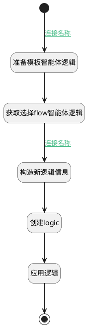

## 建立默认flow交谈逻辑 <!-- {docsify-ignore-all} -->

   

### 处理过程




### 处理步骤说明

#### 准备模板智能体逻辑 :id=PREPAREPARAM_01<sup class="footnote-symbol"> <font color=gray size=1>[准备参数]</font></sup>


1. 将`ai.AI_AGENT_CONTEXT.agent_flow_templ` 设置给  `original_delogic.PSDELOGICID(实体处理逻辑标识)`

#### 获取选择flow智能体逻辑 :id=DEACTION_03<sup class="footnote-symbol"> <font color=gray size=1>[实体行为]</font></sup>


调用实体 [实体处理逻辑(PSDELOGIC)](module/extension/PSDELogic.md) 行为 [Get](module/extension/PSDELogic#行为) ，行为参数为`original_delogic`

将执行结果返回给参数`original_delogic`

#### 开始 :id=Begin<sup class="footnote-symbol"> <font color=gray size=1>[开始]</font></sup>


*- N/A*
#### 创建logic :id=DEACTION_04<sup class="footnote-symbol"> <font color=gray size=1>[实体行为]</font></sup>


调用实体 [实体处理逻辑(PSDELOGIC)](module/extension/PSDELogic.md) 行为 [Create](module/extension/PSDELogic#行为) ，行为参数为`original_delogic`

将执行结果返回给参数`original_delogic`

#### 构造新逻辑信息 :id=RAWSFCODE_03<sup class="footnote-symbol"> <font color=gray size=1>[直接后台代码]</font></sup>


<p class="panel-title"><b>执行代码[Groovy]</b></p>

```groovy
def _original_delogic = logic.param('original_delogic').getReal();
def _default = logic.param('Default').getReal()
_original_delogic.id=_default.code_name+ "@ai.AI_AGENT_CONTEXT.agent_flow_templ"
_original_delogic.psdeid=_default.code_name+ "@ai.AI_AGENT_CONTEXT"
_original_delogic.psdelogicname=_default.name

```

#### 应用逻辑 :id=DEACTION_05<sup class="footnote-symbol"> <font color=gray size=1>[实体行为]</font></sup>


调用实体 [实体处理逻辑(PSDELOGIC)](module/extension/PSDELogic.md) 行为 [应用(APPLY)](module/extension/PSDELogic#行为) ，行为参数为`original_delogic`

#### 结束 :id=END_01<sup class="footnote-symbol"> <font color=gray size=1>[结束]</font></sup>


返回 `Default(传入变量)`


### 连接条件说明
#### 连接名称 :id=Begin-PREPAREPARAM_01

`Default(传入变量).FLOW_MODE(智能体工作流模式)` EQ `DE`
#### 连接名称 :id=DEACTION_03-RAWSFCODE_03

`original_delogic(original_delogic).PSDELOGICID(实体处理逻辑标识)` ISNOTNULL


### 实体逻辑参数

|    中文名   |    代码名    |  数据类型    |  实体   |备注 |
| --------| --------| -------- | -------- | --------   |
|传入变量(<i class="fa fa-check"/></i>)|Default|数据对象|[智能体业务上下文(AI_AGENT_CONTEXT)](module/ai/ai_agent_context.md)||
|original_ag_context|original_ag_context|数据对象|[智能体业务上下文(AI_AGENT_CONTEXT)](module/ai/ai_agent_context.md)||
|original_delogic|original_delogic|数据对象|[实体处理逻辑(PSDELOGIC)](module/extension/PSDELogic.md)||
