## 删除logic扩展模型 <!-- {docsify-ignore-all} -->

   

### 处理过程

```plantuml
@startuml
hide empty description
<style>
root {
  HyperlinkColor #42b983
}
</style>

hide empty description
state "开始" as Begin <<start>> [[$./delete_extend_model#begin {"开始"}]]
state "获取extend_logic" as DEACTION_01  [[$./delete_extend_model#deaction_01 {"获取extend_logic"}]]
state "删除extend_logic" as DEACTION_02  [[$./delete_extend_model#deaction_02 {"删除extend_logic"}]]
state "获取agent_context" as DEACTION_03  [[$./delete_extend_model#deaction_03 {"获取agent_context"}]]
state "查看logic数据" as DEBUGPARAM_01  [[$./delete_extend_model#debugparam_01 {"查看logic数据"}]]
state "结束" as END_01 <<end>> [[$./delete_extend_model#end_01 {"结束"}]]
state "拼接model标识" as RAWSFCODE_01  [[$./delete_extend_model#rawsfcode_01 {"拼接model标识"}]]


Begin --> DEACTION_03
DEACTION_03 --> RAWSFCODE_01
RAWSFCODE_01 --> DEACTION_01
DEACTION_01 --> DEBUGPARAM_01 : [[$./delete_extend_model#deaction_01-debugparam_01{连接名称} 连接名称]]
DEBUGPARAM_01 --> DEACTION_02
DEACTION_02 --> END_01


@enduml
```




### 处理步骤说明

#### 开始 :id=Begin<sup class="footnote-symbol"> <font color=gray size=1>[开始]</font></sup>


*- N/A*
#### 获取agent_context :id=DEACTION_03<sup class="footnote-symbol"> <font color=gray size=1>[实体行为]</font></sup>


调用实体 [智能体业务上下文(AI_AGENT_CONTEXT)](module/ai/ai_agent_context.md) 行为 [Get](module/ai/ai_agent_context#行为) ，行为参数为`Default(传入变量)`

将执行结果返回给参数`Default(传入变量)`

#### 拼接model标识 :id=RAWSFCODE_01<sup class="footnote-symbol"> <font color=gray size=1>[直接后台代码]</font></sup>


<p class="panel-title"><b>执行代码[Groovy]</b></p>

```groovy
def _default = logic.param('default').getReal()
def _delogic = logic.param('delogic').getReal()
_delogic.id=_default.code_name+ "@ai.AI_AGENT_CONTEXT.agent_flow_templ"

```

#### 获取extend_logic :id=DEACTION_01<sup class="footnote-symbol"> <font color=gray size=1>[实体行为]</font></sup>


调用实体 [实体处理逻辑(PSDELOGIC)](module/extension/PSDELogic.md) 行为 [Get](module/extension/PSDELogic#行为) ，行为参数为`delogic`

将执行结果返回给参数`delogic`

#### 查看logic数据 :id=DEBUGPARAM_01<sup class="footnote-symbol"> <font color=gray size=1>[调试逻辑参数]</font></sup>


> [!NOTE|label:调试信息|icon:fa fa-bug]
> 调试输出参数`delogic`的详细信息


#### 删除extend_logic :id=DEACTION_02<sup class="footnote-symbol"> <font color=gray size=1>[实体行为]</font></sup>


调用实体 [实体处理逻辑(PSDELOGIC)](module/extension/PSDELogic.md) 行为 [Remove](module/extension/PSDELogic#行为) ，行为参数为`delogic`

#### 结束 :id=END_01<sup class="footnote-symbol"> <font color=gray size=1>[结束]</font></sup>


返回 `Default(传入变量)`


### 连接条件说明
#### 连接名称 :id=DEACTION_01-DEBUGPARAM_01

`delogic(delogic).DYNAMODELFLAG(扩展模型)` EQ `1`


### 实体逻辑参数

|    中文名   |    代码名    |  数据类型    |  实体   |备注 |
| --------| --------| -------- | -------- | --------   |
|传入变量(<i class="fa fa-check"/></i>)|Default|数据对象|[智能体业务上下文(AI_AGENT_CONTEXT)](module/ai/ai_agent_context.md)||
|delogic|delogic|数据对象|[实体处理逻辑(PSDELOGIC)](module/extension/PSDELogic.md)||
