## fill_with_agent <!-- {docsify-ignore-all} -->

   由插件补充填充，此配置仅作为填充入口

### 处理过程

```plantuml
@startuml
hide empty description
<style>
root {
  HyperlinkColor #42b983
}
</style>

hide empty description
state "开始" as Begin <<start>> [[$./fill_with_agent#begin {"开始"}]]
state "获取数据" as DEACTION_01  [[$./fill_with_agent#deaction_01 {"获取数据"}]]
state "结束" as END_01 <<end>> [[$./fill_with_agent#end_01 {"结束"}]]


Begin --> DEACTION_01
DEACTION_01 --> END_01


@enduml
```

### 处理步骤说明

#### 开始 :id=Begin [开始]

*- N/A*
#### 获取数据 :id=DEACTION_01 [实体行为]

调用实体 [智能体业务上下文(AI_AGENT_CONTEXT)](module/ai/ai_agent_context.md) 行为 [Get](module/ai/ai_agent_context#行为) ，行为参数为`Default(传入变量)`

将执行结果返回给参数`Default(传入变量)`

#### 结束 :id=END_01 [结束]

返回 `Default(传入变量)`

### 实体逻辑参数

|    中文名   |    代码名    |  数据类型    |  实体   |备注 |
| --------| --------| -------- | -------- | --------   |
|传入变量(<i class="fa fa-check"/></i>)|Default|数据对象|[智能体业务上下文(AI_AGENT_CONTEXT)](module/ai/ai_agent_context.md)||
