## reload_aiagents <!-- {docsify-ignore-all} -->

   重载AI代理对象

### 处理过程

```plantuml
@startuml
hide empty description
<style>
root {
  HyperlinkColor #42b983
}
</style>

hide empty description
state "开始" as Begin <<start>> [[$./reload_aiagents#begin {"开始"}]]
state "触发刷新信号" as RAWSFCODE_01  [[$./reload_aiagents#rawsfcode_01 {"触发刷新信号"}]]


Begin --> RAWSFCODE_01


@enduml
```




### 处理步骤说明

#### 开始 :id=Begin<sup class="footnote-symbol"> <font color=gray size=1>[开始]</font></sup>


*- N/A*
#### 触发刷新信号 :id=RAWSFCODE_01<sup class="footnote-symbol"> <font color=gray size=1>[直接后台代码]</font></sup>


<p class="panel-title"><b>执行代码[Groovy]</b></p>

```groovy
def system_id = sys.deploySystemId
//合成当前系统AI工厂reload信号标识
def reload_tag = "reloadsignal-$system_id-sysaifactory-ai-ibizplmintelligence"
def config = [:]
config.reload_time = net.ibizsys.runtime.util.DateUtils.getCurTimeString()
//发布配置
net.ibizsys.central.cloud.core.spring.rt.ServiceHub.getInstance().publishConfig(reload_tag, config)

```


### 实体逻辑参数

|    中文名   |    代码名    |  数据类型    |  实体   |备注 |
| --------| --------| -------- | -------- | --------   |
|传入变量(<i class="fa fa-check"/></i>)|Default|数据对象|[智能体业务上下文(AI_AGENT_CONTEXT)](module/ai/ai_agent_context.md)||
