## template_feedback <!-- {docsify-ignore-all} -->

   

### 处理过程

```plantuml
@startuml
hide footbox
<style>
root {
  HyperlinkColor #42b983
}
</style>

hide empty description
state "开始" as Begin <<start>> [[$./template_feedback#begin {开始}]]
state "结束" as END_01 <<end>> [[$./template_feedback#end_01 {结束}]]
state "注入脚本代码" as RAWJSCODE_01  [[$./template_feedback#rawjscode_01 {注入脚本代码}]]


Begin --> RAWJSCODE_01
RAWJSCODE_01 --> END_01


@enduml
```




### 处理步骤说明

#### 开始 :id=Begin<sup class="footnote-symbol"> <font color=gray size=1>[开始]</font></sup>


#### 注入脚本代码 :id=RAWJSCODE_01<sup class="footnote-symbol"> <font color=gray size=1>[直接前台代码]</font></sup>


<p class="panel-title"><b>执行代码</b></p>

```javascript
console.info("ai default_system_prompt");
var answer = null;
var realView = view;
var _entity_tag = view.context._entity_tag;
if (realView.model.appDataEntityId && realView.model.appDataEntityId.endsWith("ai_agent_assignment")) {
    realView = view.parentView;
}
if (!_entity_tag) {
    _entity_tag = realView.model.appDataEntityId ? realView.model.appDataEntityId.split('.').at(-1) : "";
}
if (_entity_tag) {
    uiLogic.default._entity_tag = _entity_tag;
}
var formController = realView.getController("form");

if (uiLogic.default.data && uiLogic.default.data.messages && uiLogic.default.data.messages.length > 0) {
    const lastAns = uiLogic.default.data.messages[uiLogic.default.data.messages.length - 1];
    answer = lastAns.realcontent;
}
else if (uiLogic.default.msg) {
    answer = uiLogic.default.msg.realcontent;
}

if (answer && typeof answer == 'string') {
    if (formController){
        var targetFormItem = formController.getFormDetail("FORMITEM","default_system_prompt");
		if(targetFormItem){
           try {
                var newvalue = '<user>\n'+answer+"\n</user>";
                
                formController.setDataValue("welcome_message", newvalue);

            } catch (error) {
            }
        }
         
    }

}
uiLogic.result = {content: "已完成"};


```

#### 结束 :id=END_01<sup class="footnote-symbol"> <font color=gray size=1>[结束]</font></sup>


### 实体逻辑参数

|    中文名   |    代码名    |  数据类型      |备注 |
| --------| --------| --------  | --------   |
|传入变量(<i class="fa fa-check"/></i>)|Default|数据对象||
|result|result|数据对象||
