## 提取session前缀并存储 <!-- {docsify-ignore-all} -->

   

### 处理过程

```plantuml
@startuml
hide empty description
<style>
root {
  HyperlinkColor #42b983
}
</style>

hide empty description
state "开始" as Begin <<start>> [[$./extract_session_type#begin {"开始"}]]
state "执行脚本代码" as RAWSFCODE_01  [[$./extract_session_type#rawsfcode_01 {"执行脚本代码"}]]
state "结束" as END_01 <<end>> [[$./extract_session_type#end_01 {"结束"}]]


Begin --> RAWSFCODE_01
RAWSFCODE_01 --> END_01


@enduml
```




### 处理步骤说明

#### 开始 :id=Begin<sup class="footnote-symbol"> <font color=gray size=1>[开始]</font></sup>


*- N/A*
#### 执行脚本代码 :id=RAWSFCODE_01<sup class="footnote-symbol"> <font color=gray size=1>[直接后台代码]</font></sup>


<p class="panel-title"><b>执行代码[Groovy]</b></p>

```groovy
// 获取sessionid参数
def _default = logic.param("default").getReal()
def sessionId = _default.get("session_id")

// 提取前缀
def prefix = ""
if(sessionId && sessionId.contains("@")) {
    prefix = sessionId.split("@")[0]
}

// 存储到conversation_type参数
_default.set("type",prefix)
```

#### 结束 :id=END_01<sup class="footnote-symbol"> <font color=gray size=1>[结束]</font></sup>


返回 `Default(传入变量)`


### 实体逻辑参数

|    中文名   |    代码名    |  数据类型    |  实体   |备注 |
| --------| --------| -------- | -------- | --------   |
|传入变量(<i class="fa fa-check"/></i>)|Default|数据对象|[智能体会话(AI_AGENT_CONVERSATION)](module/ai/ai_agent_conversation.md)||
