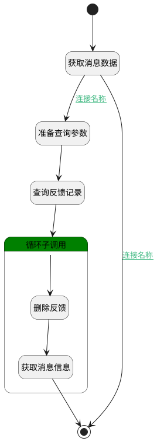

## 取消点赞或点踩 <!-- {docsify-ignore-all} -->

   

### 处理过程

### 处理步骤说明

#### 获取消息数据 :id=DEACTION_03 [实体行为]

调用实体 [智能体会话消息(AI_AGENT_MESSAGE)](module/ai/ai_agent_message.md) 行为 [Get](module/ai/ai_agent_message#行为) ，行为参数为`Default(传入变量)`

将执行结果返回给参数`Default(传入变量)`

#### 准备查询参数 :id=PREPAREPARAM_01 [准备参数]

1. 将`Default(传入变量).ID(标识)` 设置给  `feedback_filter.n_message_id_eq`
2. 将`用户全局对象.srfpersionid` 设置给  `feedback_filter.n_user_id_eq`
3. 将`Default(传入变量).feedback_type` 设置给  `feedback_filter.n_feedback_type_eq`
4. 将`1000` 设置给  `feedback_filter.size`

#### 查询反馈记录 :id=DEDATASET_01 [实体数据集]

调用实体 [智能体回复反馈(AI_AGENT_FEEDBACK)](module/ai/ai_agent_feedback.md) 数据集合 [DEFAULT](module/ai/ai_agent_feedback#数据集合) ，查询参数为`feedback_filter`

将执行结果返回给参数`feedback_pages`

#### 循环子调用 :id=LOOPSUBCALL_01 [循环子调用]

循环参数`feedback_pages`，子循环参数使用`feedback`
#### 开始 :id=Begin [开始]

*- N/A*
#### 删除反馈 :id=DEACTION_01 [实体行为]

调用实体 [智能体回复反馈(AI_AGENT_FEEDBACK)](module/ai/ai_agent_feedback.md) 行为 [Remove](module/ai/ai_agent_feedback#行为) ，行为参数为`feedback`

#### 获取消息信息 :id=DEACTION_02 [实体行为]

调用实体 [智能体会话消息(AI_AGENT_MESSAGE)](module/ai/ai_agent_message.md) 行为 [Get](module/ai/ai_agent_message#行为) ，行为参数为`Default(传入变量)`

将执行结果返回给参数`Default(传入变量)`

#### 结束 :id=END_01 [结束]

返回 `Default(传入变量)`

### 连接条件说明
#### 连接名称 :id=DEACTION_03-PREPAREPARAM_01

(`Default(传入变量).IS_LIKE(是否点赞)` EQ `1` OR `Default(传入变量).IS_DISLIKE(是否点踩)` EQ `1`)
#### 连接名称 :id=DEACTION_03-END_01

`Default(传入变量).IS_LIKE(是否点赞)` NOTEQ `1` AND `Default(传入变量).IS_DISLIKE(是否点踩)` NOTEQ `1`

### 实体逻辑参数

|    中文名   |    代码名    |  数据类型    |  实体   |备注 |
| --------| --------| -------- | -------- | --------   |
|传入变量(<i class="fa fa-check"/></i>)|Default|数据对象|[智能体会话消息(AI_AGENT_MESSAGE)](module/ai/ai_agent_message.md)||
|feedback|feedback|数据对象|[智能体回复反馈(AI_AGENT_FEEDBACK)](module/ai/ai_agent_feedback.md)||
|feedback_filter|feedback_filter|过滤器|||
|feedback_pages|feedback_pages|分页查询|||
