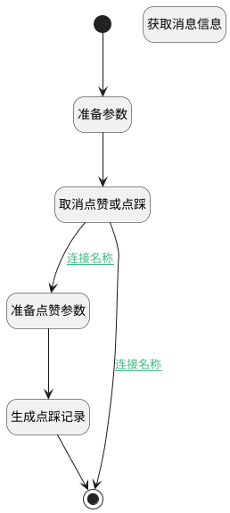

## 点踩 <!-- {docsify-ignore-all} -->

   

### 处理过程

### 处理步骤说明

#### 准备点赞参数 :id=PREPAREPARAM_01 [准备参数]

1. 将`dislike` 设置给  `ai_agent_feedback.FEEDBACK_TYPE(反馈类型)`
2. 将`Default(传入变量).ID(标识)` 设置给  `ai_agent_feedback.MESSAGE_ID(消息标识)`
3. 将`用户全局对象.srfpersonid` 设置给  `ai_agent_feedback.USER_ID(用户标识)`
4. 将`Default(传入变量).FEEDBACK_CONTENT(反馈内容)` 设置给  `ai_agent_feedback.FEEDBACK_CONTENT(反馈内容)`

#### 生成点踩记录 :id=DEACTION_01 [实体行为]

调用实体 [智能体回复反馈(AI_AGENT_FEEDBACK)](module/ai/ai_agent_feedback.md) 行为 [Create](module/ai/ai_agent_feedback#行为) ，行为参数为`ai_agent_feedback`

#### 取消点赞或点踩 :id=DELOGIC_01 [实体逻辑]

调用实体 [智能体会话消息(AI_AGENT_MESSAGE)](module/ai/ai_agent_message.md) 处理逻辑 [取消点赞或点踩]((module/ai/ai_agent_message/logic/cancel_feedback.md)) ，行为参数为`message(message)`
将执行结果返回给参数`message(message)`

#### 准备参数 :id=PREPAREPARAM_02 [准备参数]

1. 将`Default(传入变量).ID(标识)` 设置给  `message.ID(标识)`

#### 开始 :id=Begin [开始]

*- N/A*
#### 结束 :id=END_01 [结束]

返回 `Default(传入变量)`

#### 获取消息信息 :id=DEACTION_02 [实体行为]

调用实体 [智能体会话消息(AI_AGENT_MESSAGE)](module/ai/ai_agent_message.md) 行为 [Get](module/ai/ai_agent_message#行为) ，行为参数为`message`

将执行结果返回给参数`message`

### 连接条件说明
#### 连接名称 :id=DELOGIC_01-PREPAREPARAM_01

`message(message).IS_DISLIKE(是否点踩)` NOTEQ `1`
#### 连接名称 :id=DELOGIC_01-END_01

`message(message).IS_DISLIKE(是否点踩)` EQ `1`

### 实体逻辑参数

|    中文名   |    代码名    |  数据类型    |  实体   |备注 |
| --------| --------| -------- | -------- | --------   |
|传入变量(<i class="fa fa-check"/></i>)|Default|数据对象|[智能体会话消息(AI_AGENT_MESSAGE)](module/ai/ai_agent_message.md)||
|ai_agent_feedback|ai_agent_feedback|数据对象|[智能体回复反馈(AI_AGENT_FEEDBACK)](module/ai/ai_agent_feedback.md)||
|message|message|数据对象|[智能体会话消息(AI_AGENT_MESSAGE)](module/ai/ai_agent_message.md)||
