## debug_context <!-- {docsify-ignore-all} -->

   

### 处理过程

```plantuml
@startuml
hide footbox
<style>
root {
  HyperlinkColor #42b983
}
</style>

hide empty description
state "开始" as Begin <<start>> [[$./debug_context#begin {开始}]]
state "界面行为" as DEUIACTION_01  [[$./debug_context#deuiaction_01 {界面行为}]]
state "注入脚本代码" as RAWJSCODE_01  [[$./debug_context#rawjscode_01 {注入脚本代码}]]


Begin --> RAWJSCODE_01
RAWJSCODE_01 --> DEUIACTION_01


@enduml
```




### 处理步骤说明

#### 开始 :id=Begin<sup class="footnote-symbol"> <font color=gray size=1>[开始]</font></sup>


#### 注入脚本代码 :id=RAWJSCODE_01<sup class="footnote-symbol"> <font color=gray size=1>[直接前台代码]</font></sup>


<p class="panel-title"><b>执行代码</b></p>

```javascript
console.log(uiLogic.default);

const target = uiLogic.default;

// 检查context_data是否存在且为字符串
if (target.context_debug_data && typeof target.context_debug_data === 'string') {
    try {
        // 将JSON字符串解析为对象
        const contextObj = JSON.parse(target.context_debug_data);
        console.log('解析后的context_data对象:', contextObj);
        //const _id = uiLogic.default.id;

        // 将解析后的对象合并到uiLogic.default中
        // 使用Object.assign进行浅合并
        if (!Array.isArray(contextObj)) {
            Object.assign(uiLogic.default, contextObj);
        }
    } catch (parseError) {
        console.error('JSON解析错误:', parseError);
        console.error('无效的JSON字符串:', target.context_debug_data);
    }

}       
 //uiLogic.default.id = _id; 
uiLogic.default._id = uiLogic.default.context_id + '-' + uiLogic.context.srfnavctrlid + '-' + (target?.id || (Date.now().toString(36) + Math.random().toString(36).substr(2, 5)));
console.log('合并后的uiLogic.default:', uiLogic.default);

```

#### 界面行为 :id=DEUIACTION_01<sup class="footnote-symbol"> <font color=gray size=1>[实体界面行为调用]</font></sup>


调用实体 [智能体会话(AI_AGENT_SESSION)](module/ai/ai_agent_session.md) 界面行为 [调试](module/ai/ai_agent_session#界面行为) ，行为参数为`Default(传入变量)`


### 实体逻辑参数

|    中文名   |    代码名    |  数据类型      |备注 |
| --------| --------| --------  | --------   |
|router|router|||
|nav|nav|||
|context|context|导航视图参数绑定参数||
|view|view|当前视图对象||
|传入变量(<i class="fa fa-check"/></i>)|Default|数据对象||
