## jenkins_build <!-- {docsify-ignore-all} -->

   

### 处理过程

```plantuml
@startuml
hide footbox
<style>
root {
  HyperlinkColor #42b983
}
</style>

hide empty description
state "开始" as Begin <<start>> [[$./jenkins_build#begin {开始}]]
state "结束" as END1 <<end>> [[$./jenkins_build#end1 {结束}]]
state "注入脚本代码" as RAWJSCODE1  [[$./jenkins_build#rawjscode1 {注入脚本代码}]]


Begin --> RAWJSCODE1
RAWJSCODE1 --> END1


@enduml
```




### 处理步骤说明

#### 开始 :id=Begin<sup class="footnote-symbol"> <font color=gray size=1>[开始]</font></sup>


#### 注入脚本代码 :id=RAWJSCODE1<sup class="footnote-symbol"> <font color=gray size=1>[直接前台代码]</font></sup>


<p class="panel-title"><b>执行代码</b></p>

```javascript
var answer = null;
if(uiLogic.default.data && uiLogic.default.data.messages && uiLogic.default.data.messages.length>0) {
    const lastAns = uiLogic.default.data.messages[uiLogic.default.data.messages.length-1];
    answer = lastAns.realcontent;
}
else if(uiLogic.default.msg) {
    answer = uiLogic.default.msg.realcontent;
}
 if(answer) {
     if (answer && typeof answer == 'string') {
        var ret =ibiz.util.jsonUtil.parseJson(answer);
        ret.project = view.parentView.context.project;
        if(ret.success && ret.data) {
            if(ret.data_type == 'jsonobject' ) {
                // API配置
                const apiUrl = 'http://172.16.240.30:8000';
                
                console.log('原始ret.data:', ret.data);

                // 直接使用ret.data作为参数
                // 确保有task_type字段
                if (!ret.data.task_type) {
                    throw new Error('参数中缺少task_type字段');
                }

                // 构建请求数据 - 直接传递ret.data
                const requestData = {
                    task_type: ret.data.task_type,
                    params: {},
                    timeout: ret.data.timeout || 300,
                    callback_url: ret.data.callback_url || null
                };

                // 将所有其他参数复制到params中
                Object.entries(ret.data).forEach(([key, value]) => {
                    if (key !== 'task_type' && key !== 'timeout' && key !== 'callback_url') {
                        requestData.params[key] = value;
                    }
                });

                console.log('API请求数据:', requestData);

                // 调用API
                const response = await fetch(`${apiUrl}/api/v1/jobs`, {
                    method: 'POST',
                    headers: {
                        'Content-Type': 'application/json',
                        'Accept': 'application/json'
                    },
                    body: JSON.stringify(requestData)
                });

                if (!response.ok) {
                    const errorText = await response.text();
                    throw new Error(`API请求失败: ${response.status} - ${errorText}`);
                }

                const result = await response.json();
                
                console.log('API返回结果:', result);
                // 设置节点返回对象
                uiLogic.result = {
                    content: result.message
                };
                ibiz.message.success(`任务已提交到调度系统，任务ID: ${result.task_id}`);
            }
        }
    }
}
```

#### 结束 :id=END1<sup class="footnote-symbol"> <font color=gray size=1>[结束]</font></sup>


### 实体逻辑参数

|    中文名   |    代码名    |  数据类型      |备注 |
| --------| --------| --------  | --------   |
|传入变量(<i class="fa fa-check"/></i>)|Default|数据对象||
|result|result|数据对象||
