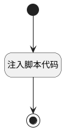

## jenkins_build <!-- {docsify-ignore-all} -->

   

### 处理过程


```plantuml
@startuml
hide footbox
<style>
root {
  HyperlinkColor #42b983
}
</style>

hide empty description
state "开始" as Begin <<start>> [[$./jenkins_build#begin {开始}]]
state "结束" as END1 <<end>> [[$./jenkins_build#end1 {结束}]]
state "注入脚本代码" as RAWJSCODE1  [[$./jenkins_build#rawjscode1 {注入脚本代码}]]


Begin --> RAWJSCODE1
RAWJSCODE1 --> END1


@enduml
```


### 处理步骤说明

#### 开始 :id=Begin<sup class="footnote-symbol"> <font color=gray size=1>[开始]</font></sup>


#### 注入脚本代码 :id=RAWJSCODE1<sup class="footnote-symbol"> <font color=gray size=1>[直接前台代码]</font></sup>


<p class="panel-title"><b>执行代码</b></p>

```javascript
var answer = null;
var formController = view.getController("form");
if(!formController) {
    formController = view.parentView.getController("form");
}
if(uiLogic.default.data && uiLogic.default.data.messages && uiLogic.default.data.messages.length>0) {
    const lastAns = uiLogic.default.data.messages[uiLogic.default.data.messages.length-1];
    answer = lastAns.realcontent;
}
else if(uiLogic.default.msg) {
    answer = uiLogic.default.msg.realcontent;
}
 if(answer) {
     if (answer && typeof answer == 'string') {
        var ret =ibiz.util.jsonUtil.parseJson(answer);
        ret.project = view.parentView.context.project;
        if(ret.success && ret.data) {
            if(ret.data_type == 'jsonobject' && formController) {
                Object.entries(ret.data).forEach(([key, value]) => {
                    if(key=="jobname"){
                        const jenkinsUrl = 'http://172.16.240.22:8080/';
                        const username = 'admin';
                        const passwordOrToken = '117f599a3ff312582f93471cea8ff5f789';
                        const jobName = value;

                        (async () => {
                            let result = null;
                            const credentials = btoa(`${username}:${passwordOrToken}`);
                            const headers = { 'Authorization': `Basic ${credentials}` };
                            const baseUrl = jenkinsUrl.replace(/\/$/, '');
                            
                            // 触发构建
                            const trigger = await fetch(`${baseUrl}/job/${encodeURIComponent(jobName)}/build`, {
                                method: 'POST',
                                headers: { ...headers, 'Content-Type': 'application/x-www-form-urlencoded' }
                            });
                            
                            if (!trigger.ok) throw new Error(`触发失败: ${trigger.status}`);
                            
                            // 获取队列位置
                            const queueUrl = trigger.headers.get('Location');
                            if (!queueUrl) throw new Error('无队列信息');
                            const queueFullUrl = queueUrl.startsWith('http') ? queueUrl : `${baseUrl}${queueUrl}`;
                                
                            ibiz.message.success('Jenkins 任务创建成功');
                        })();                        
                    }
                });
            }
  }
 }
}
```

#### 结束 :id=END1<sup class="footnote-symbol"> <font color=gray size=1>[结束]</font></sup>


### 实体逻辑参数

|    中文名   |    代码名    |  数据类型      |备注 |
| --------| --------| --------  | --------   |
|传入变量(<i class="fa fa-check"/></i>)|Default|数据对象||
|result|result|数据对象||
