## 获取Cloud配置 <!-- {docsify-ignore-all} -->

   

### 处理过程

```plantuml
@startuml
hide empty description
<style>
root {
  HyperlinkColor #42b983
}
</style>

hide empty description
state "开始" as Begin <<start>> [[$./get_cloud_config#begin {"开始"}]]
state "结束" as END_01 <<end>> [[$./get_cloud_config#end_01 {"结束"}]]
state "设置禁用" as PREPAREPARAM_01  [[$./get_cloud_config#prepareparam_01 {"设置禁用"}]]


Begin --> PREPAREPARAM_01 : [[$./get_cloud_config#begin-prepareparam_01{禁用时} 禁用时]]
Begin --> END_01


@enduml
```

### 处理步骤说明

#### 开始 :id=Begin [开始]

*- N/A*
#### 结束 :id=END_01 [结束]

返回 `map`

#### 设置禁用 :id=PREPAREPARAM_01 [准备参数]

1. 将`1` 设置给  `map.disabled`

### 连接条件说明
#### 禁用时 :id=Begin-PREPAREPARAM_01

`Default(传入变量).ACTIVE(启用凭证)` EQ `0`

### 实体逻辑参数

|    中文名   |    代码名    |  数据类型    |  实体   |备注 |
| --------| --------| -------- | -------- | --------   |
|传入变量(<i class="fa fa-check"/></i>)|Default|数据对象|[AI凭证(AI_CREDENTIAL)](module/ai/ai_credential.md)||
|map|map|数据对象|||
