## 检索测试 <!-- {docsify-ignore-all} -->

   

### 处理过程

```plantuml
@startuml
hide empty description
<style>
root {
  HyperlinkColor #42b983
}
</style>

hide empty description
state "开始" as Begin <<start>> [[$./retrieval_test#begin {"开始"}]]
state "检索测试" as RAWSFCODE_01  [[$./retrieval_test#rawsfcode_01 {"检索测试"}]]
state "绑定参数" as BINDPARAM_01  [[$./retrieval_test#bindparam_01 {"绑定参数"}]]
state "结束" as END_01 <<end>> [[$./retrieval_test#end_01 {"结束"}]]


Begin --> RAWSFCODE_01
RAWSFCODE_01 --> BINDPARAM_01
BINDPARAM_01 --> END_01


@enduml
```




### 处理步骤说明

#### 检索测试 :id=RAWSFCODE_01<sup class="footnote-symbol"> <font color=gray size=1>[直接后台代码]</font></sup>


<p class="panel-title"><b>执行代码[Groovy]</b></p>

```groovy
def _default = logic.param('Default').getReal()
def query = _default.get('query')
def kb_id = _default.get('kb_id')
if (query && kb_id){
    def _params = [:]
    def n_rerank_eq = (_default.get('n_rerank_eq') as Integer) ?: 0
    def similarity_threshold = (_default.get("similarity_threshold") as BigDecimal) ?: 0
    def keyword_similarity_weight = (_default.get("keyword_similarity_weight") as BigDecimal) ?: 0
    def n_vector_similarity_gtandeq = 1 - keyword_similarity_weight
    def top_k = (_default.get("top_k") as Integer) ?: 0
    def cross_languages = _default.get("cross_languages") ?: ""
    def use_kg = (_default.get("use_kg") as Boolean) ?: false
    def n_pageindex_eq = (_default.get('n_pageindex_eq') as Integer) ?: 0
    _params.put('size', top_k)
    _params.put('query', query)
    _params.put('n_rerank_eq', n_rerank_eq)
    _params.put('n_similarity_gtandeq', similarity_threshold)
    _params.put('n_vector_similarity_gtandeq', n_vector_similarity_gtandeq)
    _params.put('top_k', top_k)
    _params.put('cross_languages', cross_languages)
    _params.put('use_kg', use_kg)
    _params.put('n_pageindex_eq', n_pageindex_eq)
    def iSysKnowledgeBaseUtilRuntime = sys.getSysUtilRuntime(net.ibizsys.central.plugin.ai.sysutil.ISysKnowledgeBaseUtilRuntime.class, false)
    def _page = iSysKnowledgeBaseUtilRuntime.fetchChunks(kb_id, _params)
    if (_page){
        def _content = _page.getContent()
        if (_content){
            def nodeMap = [:]
            def roots = []
            // 1. 遍历平铺数据，构建节点映射表
            for (node in _content) {
                def id = node.id
                def pid = node.pid
                if (!id) continue
                // 复制原始节点数据并添加children字段
                def newNode = [:]
                newNode.putAll(node.any())
                newNode.children = []
                newNode.has_children = 0
                nodeMap[id] = newNode
            }
            // 2. 构建父子关系
            for (id in nodeMap.keySet()) {
                def node = nodeMap[id]
                def pid = node.pid?.toString()

                // 判断是否为根节点（父ID为空）
                if (!pid || pid == "") {
                    roots.add(node)
                } else {
                    // 将当前节点添加到父节点的子节点列表
                    def parentNode = nodeMap[pid]
                    if (parentNode) {
                        parentNode.children.add(node)
                        parentNode.has_children = 1
                    } else {
                        // 父节点不存在，视为新根节点
                        roots.add(node)
                    }
                }
            }
            // 3. 设置结果（返回树形结构）
            _default.set('result', roots)
        }
    }
}
```

#### 绑定参数 :id=BINDPARAM_01<sup class="footnote-symbol"> <font color=gray size=1>[绑定参数]</font></sup>


绑定参数`Default(传入变量)` 到 `page`
#### 结束 :id=END_01<sup class="footnote-symbol"> <font color=gray size=1>[结束]</font></sup>


返回 `page`

#### 开始 :id=Begin<sup class="footnote-symbol"> <font color=gray size=1>[开始]</font></sup>


*- N/A*


### 实体逻辑参数

|    中文名   |    代码名    |  数据类型    |  实体   |备注 |
| --------| --------| -------- | -------- | --------   |
|传入变量(<i class="fa fa-check"/></i>)|Default|过滤器|||
|page|page|数据对象列表|||
