## 填充知识库切片策略 <!-- {docsify-ignore-all} -->

   

### 处理过程

```plantuml
@startuml
hide empty description
<style>
root {
  HyperlinkColor #42b983
}
</style>

hide empty description
state "开始" as Begin <<start>> [[$./fill_kb_chunk#begin {"开始"}]]
state "结束" as END_01 <<end>> [[$./fill_kb_chunk#end_01 {"结束"}]]
state "准备参数" as PREPAREPARAM_01  [[$./fill_kb_chunk#prepareparam_01 {"准备参数"}]]
state "查询知识库切片策略" as DEACTION_01  [[$./fill_kb_chunk#deaction_01 {"查询知识库切片策略"}]]
state "填充知识库参数" as PREPAREPARAM_02  [[$./fill_kb_chunk#prepareparam_02 {"填充知识库参数"}]]


Begin --> PREPAREPARAM_01 : [[$./fill_kb_chunk#begin-prepareparam_01{连接名称} 连接名称]]
PREPAREPARAM_01 --> DEACTION_01
DEACTION_01 --> PREPAREPARAM_02
PREPAREPARAM_02 --> END_01


@enduml
```

### 处理步骤说明

#### 开始 :id=Begin [开始]

*- N/A*
#### 结束 :id=END_01 [结束]

返回 `Default(传入变量)`

#### 准备参数 :id=PREPAREPARAM_01 [准备参数]

1. 将`Default(传入变量).KB_ID(知识库标识)` 设置给  `kb.ID(知识库标识)`

#### 查询知识库切片策略 :id=DEACTION_01 [实体行为]

调用实体 [知识库(AI_KNOWLEDGE_BASE)](module/ai/ai_knowledge_base.md) 行为 [Get](module/ai/ai_knowledge_base#行为) ，行为参数为`kb`

将执行结果返回给参数`kb`

#### 填充知识库参数 :id=PREPAREPARAM_02 [准备参数]

1. 将`kb.PARSER_CONFIG(解析配置)` 设置给  `Default(传入变量).PARSER_CONFIG(解析配置)`
2. 将`100` 设置给  `Default(传入变量).CHUNK_NUM(切片数量)`
3. 将`kb.CHUNK_METHOD(切片方法)` 设置给  `Default(传入变量).CHUNK_METHOD(切片方法)`

### 连接条件说明
#### 连接名称 :id=Begin-PREPAREPARAM_01

`Default(传入变量).CUSTOM_CHUNK(自定义切片)` EQ `1`

### 实体逻辑参数

|    中文名   |    代码名    |  数据类型    |  实体   |备注 |
| --------| --------| -------- | -------- | --------   |
|传入变量(<i class="fa fa-check"/></i>)|Default|数据对象|[知识库文档(AI_KB_DOCUMENT)](module/ai/ai_kb_document.md)||
|kb|kb|数据对象|[知识库(AI_KNOWLEDGE_BASE)](module/ai/ai_knowledge_base.md)||
