## 生成文档执行计划 <!-- {docsify-ignore-all} -->

   

### 处理过程

```plantuml
@startuml
hide empty description
<style>
root {
  HyperlinkColor #42b983
}
</style>

hide empty description
state "开始" as Begin <<start>> [[$./generate_doc_scheduled#begin {"开始"}]]
state "准备参数" as PREPAREPARAM_01  [[$./generate_doc_scheduled#prepareparam_01 {"准备参数"}]]
state "构造定时器策略" as RAWSFCODE_01  [[$./generate_doc_scheduled#rawsfcode_01 {"构造定时器策略"}]]
state "创建文档执行计划" as DEACTION_01  [[$./generate_doc_scheduled#deaction_01 {"创建文档执行计划"}]]


Begin --> PREPAREPARAM_01 : [[$./generate_doc_scheduled#begin-prepareparam_01{连接名称} 连接名称]]
PREPAREPARAM_01 --> RAWSFCODE_01
RAWSFCODE_01 --> DEACTION_01


@enduml
```




### 处理步骤说明

#### 准备参数 :id=PREPAREPARAM_01<sup class="footnote-symbol"> <font color=gray size=1>[准备参数]</font></sup>


1. 将`SYNC_DOCUMENT` 设置给  `extend_schedule(task).TASK_TYPE(任务类型)`
2. 将`AI_KB_DOCUMENT` 设置给  `extend_schedule(task).PRINCIPAL_TYPE(任务主体类型)`
3. 将`知识库文档` 设置给  `extend_schedule(task).PRINCIPAL_NAME(任务主体名称)`
4. 将`Default(传入变量).ID(知识库文档标识)` 设置给  `extend_schedule(task).PRINCIPAL_ID(任务主体标识)`

#### 构造定时器策略 :id=RAWSFCODE_01<sup class="footnote-symbol"> <font color=gray size=1>[直接后台代码]</font></sup>


<p class="panel-title"><b>执行代码[Groovy]</b></p>

```groovy
def _default = logic.param('default').getReal()
def _extend_schedule = logic.param('extend_schedule').getReal()
def sync_frequency = _default.sync_frequency
def frequencyMap = [
    'daily': '0 0 * * *',
    'weekly': '0 0 * * 1', 
    'monthly': '0 0 1 * *'
]
_extend_schedule.timer_policy = frequencyMap[sync_frequency]
_extend_schedule.name="["+_default.name+"]文档执行计划"
```

#### 开始 :id=Begin<sup class="footnote-symbol"> <font color=gray size=1>[开始]</font></sup>


*- N/A*
#### 创建文档执行计划 :id=DEACTION_01<sup class="footnote-symbol"> <font color=gray size=1>[实体行为]</font></sup>


调用实体 [扩展执行计划(EXTEND_SCHEDULE)](module/Base/extend_schedule.md) 行为 [Create](module/Base/extend_schedule#行为) ，行为参数为`extend_schedule(task)`


### 连接条件说明
#### 连接名称 :id=Begin-PREPAREPARAM_01

`Default(传入变量).SYNC_ID(文档同步标识)` ISNULL AND `Default(传入变量).TYPE(文档类型)` EQ `space`


### 实体逻辑参数

|    中文名   |    代码名    |  数据类型    |  实体   |备注 |
| --------| --------| -------- | -------- | --------   |
|传入变量(<i class="fa fa-check"/></i>)|Default|数据对象|[知识库文档(AI_KB_DOCUMENT)](module/ai/ai_kb_document.md)||
|task|extend_schedule|数据对象|[扩展执行计划(EXTEND_SCHEDULE)](module/Base/extend_schedule.md)||
