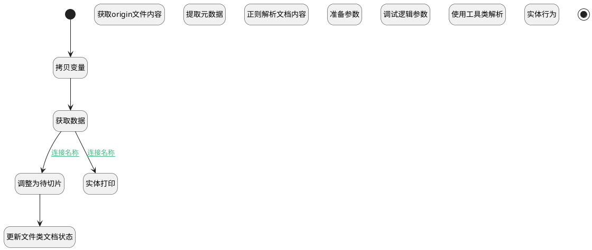

## 文档解析处理 <!-- {docsify-ignore-all} -->

   

### 处理过程




### 处理步骤说明

#### 开始 :id=Begin<sup class="footnote-symbol"> <font color=gray size=1>[开始]</font></sup>


*- N/A*
#### 拷贝变量 :id=PREPAREPARAM_02<sup class="footnote-symbol"> <font color=gray size=1>[准备参数]</font></sup>


1. 将`Default(传入变量)` 拷贝到  `document`

#### 调整为待切片 :id=PREPAREPARAM_03<sup class="footnote-symbol"> <font color=gray size=1>[准备参数]</font></sup>


1. 将`3` 设置给  `Default(传入变量).STATUS(状态)`

#### 更新文件类文档状态 :id=DEACTION_04<sup class="footnote-symbol"> <font color=gray size=1>[实体行为]</font></sup>


调用实体 [知识库文档(AI_KB_DOCUMENT)](module/ai/ai_kb_document.md) 行为 [Update](module/ai/ai_kb_document#行为) ，行为参数为`Default(传入变量)`

#### 获取数据 :id=DEACTION_01<sup class="footnote-symbol"> <font color=gray size=1>[实体行为]</font></sup>


调用实体 [知识库文档(AI_KB_DOCUMENT)](module/ai/ai_kb_document.md) 行为 [Get](module/ai/ai_kb_document#行为) ，行为参数为`Default(传入变量)`

#### 获取origin文件内容 :id=RAWSFCODE_01<sup class="footnote-symbol"> <font color=gray size=1>[直接后台代码]</font></sup>


<p class="panel-title"><b>执行代码[Groovy]</b></p>

```groovy
def _default = logic.param('Default').getReal()
def _document = logic.param('document').getReal()
// def _type = _default.get('type')
// if (_type == 'file'){
//     def iCloudOSSClient = sys.getSysUtilRuntime(net.ibizsys.central.cloud.core.sysutil.ISysCloudClientUtilRuntime.class, false).getServiceClient("cloud-oss", net.ibizsys.central.cloud.core.cloudutil.client.ICloudOSSClient.class, true)
//     def fileJson = _default.get("file")
//     if (fileJson){
//         def file = new groovy.json.JsonSlurper().parseText(fileJson)
//         if (file.size() > 0){
//             println("输出file"+file[0])
//             def fileId = file[0].id
//             def folder = file[0].folder
//             def fileText = iCloudOSSClient.downloadText(folder, fileId)
//             _default.set("parsed_content", fileText)
//         }
//     }
// }
_default.set("parsed_content", _document.get("original_content"))
```

#### 实体打印 :id=RAWSFCODE_03<sup class="footnote-symbol"> <font color=gray size=1>[直接后台代码]</font></sup>


<p class="panel-title"><b>执行代码[Groovy]</b></p>

```groovy
def _default = logic.param('Default').getReal()
def deCodeName = _default.get('source_type')
def dstEntityKey = _default.get('source_id')
if (deCodeName && dstEntityKey) {
    def dstEntityRuntime = sys.dataentity(deCodeName)
    def bos = new java.io.ByteArrayOutputStream()
    def dePrintCodeName = "chat_resource"
    def keys = [dstEntityKey] as Object[]
    net.ibizsys.central.cloud.core.security.IEmployeeContext lastEmployeeContext = net.ibizsys.central.cloud.core.security.EmployeeContext.getCurrent();
    try {
        net.ibizsys.central.cloud.core.security.EmployeeContext.setCurrent(sys.createSuperUserContext());
        dstEntityRuntime.outputPrint(
            dePrintCodeName,
            bos,
            keys,
            null,
            false
        )
    }
    finally {
        net.ibizsys.central.cloud.core.security.EmployeeContext.setCurrent(lastEmployeeContext);
    }

    _default.set("parsed_content", bos.toString("utf-8"))
}
```

#### 提取元数据 :id=DEACTION_03<sup class="footnote-symbol"> <font color=gray size=1>[实体行为]</font></sup>


调用实体 [知识库文档(AI_KB_DOCUMENT)](module/ai/ai_kb_document.md) 行为 [提取元数据(extract_meta_data)](module/ai/ai_kb_document#行为) ，行为参数为`Default(传入变量)`

将执行结果返回给参数`Default(传入变量)`

#### 正则解析文档内容 :id=RAWSFCODE_02<sup class="footnote-symbol"> <font color=gray size=1>[直接后台代码]</font></sup>


<p class="panel-title"><b>执行代码[Groovy]</b></p>

```groovy
def _default = logic.param('Default').getReal()
def parsed_content = _default.get('parsed_content')
def custom_chunk = _default.get('custom_chunk')
def parser_config
if (custom_chunk == 0){
    // 使用所属知识库默认规则
    def knowledge_base_runtime = sys.dataentity('ai_knowledge_base')
    def knowledge_base = knowledge_base_runtime.get(_default.get('kb_id'))
    if (knowledge_base){
        parser_config = knowledge_base.get('parser_config')
    }
}else if (custom_chunk == 1){
    // 使用自定义规则
    parser_config = _default.get('parser_config')
}
if (parser_config){
    // 1. 预处理规则
    def pre_process_rules = parser_config.get('pre_process_rules')
    if (pre_process_rules) {
        def rulesList = pre_process_rules.split(',')
        // 合并多余空格/换行（保留单个空格，移除连续空白）
        if (rulesList.contains('remove_extra_whitespace')) {
            parsed_content = parsed_content.replaceAll(/[\s\u3000]+/, ' ')
        }

        // 移除 <script> 和 <style> 内容（保留其他标签，如 <div>）
        if (rulesList.contains('remove_js_css')) {
            // 先移除 <script> 标签内容
            parsed_content = parsed_content.replaceAll(/<script[^>]*>[\s\S]*?<\/script>/, '')
            // 再移除 <style> 标签内容
            parsed_content = parsed_content.replaceAll(/<style[^>]*>[\s\S]*?<\/style>/, '')
        }

        // 剥离 HTML 标签（保留纯文本，如 <p>Hello</p> → Hello）
        if (rulesList.contains('remove_html_tags')) {
            parsed_content = parsed_content.replaceAll(/<[^>]+>/, '')
        }
        
        //移除Md格式中的图片与链接
        if (rulesList.contains('remove_img_url')) {
            // 移除Markdown图片格式：
            parsed_content = parsed_content.replaceAll(/!\[([^\]]*)\]\(([^)]*)\)/, '')
            // 移除Markdown链接格式：[text](url)
            parsed_content = parsed_content.replaceAll(/\[([^\]]*)\]\(([^)]*)\)/, '')
        }

        // 移除电子邮箱及 URL（精准匹配，避免误删）
        if (rulesList.contains('remove_emails_url')) {
            // 移除 URL（http/https 开头）
            parsed_content = parsed_content.replaceAll(/https?:\/\/[^\s]+/, '')
            // 移除电子邮箱（标准格式）
            parsed_content = parsed_content.replaceAll(/[\w\.-]+@[\w\.-]+\.\w+/, '')
        }

        // 统一中英文标点（如 “” → "，‘’ → '）
        if (rulesList.contains('normalize_punctuation')) {
            parsed_content = parsed_content
                .replace('，', ',')
                .replace('。', '.')
                .replace('！', '!')
                .replace('？', '?')
                .replace('；', ';')
                .replace('：', ':')
                .replace('（', '(')
                .replace('）', ')')
                .replace('“', '"')
                .replace('”', '"')
                .replace('‘', "'")
                .replace('’', "'")
        }
    }
    // 2. 自定义脱敏规则
    def data_masking_rules = parser_config.get('data_masking_rules')
    if (data_masking_rules){
        // 根据正则规则pattern对parsed_content进行替换
        def masked_data = logic.param('masked_data').getReal()
        for (data_masking_rule in data_masking_rules){
            def pattern = data_masking_rule.get('pattern')
            def replacement = data_masking_rule.get('replacement')?:''
            if (pattern){
                parsed_content = parsed_content.replaceAll(pattern, replacement)
            }
        }
    }
    def masked_data = logic.param('masked_data').getReal()
    masked_data.set("id", _default.get("id"))
    masked_data.set("parsed_content", parsed_content)
    masked_data.set("status", "3")

}
```

#### 准备参数 :id=PREPAREPARAM_01<sup class="footnote-symbol"> <font color=gray size=1>[准备参数]</font></sup>


1. 将`Default(传入变量).meta_data(文档元数据)` 设置给  `masked_data.META_DATA(文档元数据)`

#### 调试逻辑参数 :id=DEBUGPARAM_02<sup class="footnote-symbol"> <font color=gray size=1>[调试逻辑参数]</font></sup>


> [!NOTE|label:调试信息|icon:fa fa-bug]
> 调试输出参数`masked_data`的详细信息


#### 使用工具类解析 :id=RAWSFCODE_04<sup class="footnote-symbol"> <font color=gray size=1>[直接后台代码]</font></sup>


<p class="panel-title"><b>执行代码[Groovy]</b></p>

```groovy
def _default = logic.param('Default').getReal()
def parsed_content = _default.get('parsed_content')
def parse_error =  _default.get('parse_error')?:""
def custom_chunk = _default.get('custom_chunk')
// 默认使用自定义规则
def parser_config = _default.get('parser_config')
if (custom_chunk == 0){
    // 使用所属知识库默认规则
    def knowledge_base_runtime = sys.dataentity('ai_knowledge_base')
    def knowledge_base = knowledge_base_runtime.get(_default.get('kb_id'))
    if (knowledge_base){
        parser_config = knowledge_base.get('parser_config')
    }
}
if (parsed_content && parser_config){
    // 辅助函数：检测内容类型
    def detectContentType = { content ->
    if (!content || !(content instanceof String)) {
        return null
    }
    try {
        new groovy.json.JsonSlurper().parseText(content.trim())
        return 'json'
    } catch (ignore) {}
    try {
        new XmlSlurper(false, false).parseText(content.trim()) // 禁用DTD和命名空间简化验证
        return 'xml'
    } catch (ignore) {}
    return null
}

    // 辅助函数：验证内容类型
    def validateContentType = { content, expectedType ->
    if (!content || !(content instanceof String) || !expectedType) {
        return false
    }
    try {
        if (expectedType == 'json') {
            new groovy.json.JsonSlurper().parseText(content.trim())
            return true
        } else if (expectedType == 'xml') {
            new XmlSlurper(false, false).parseText(content.trim())
            return true
        }
    } catch (Exception e) {
        return false
    }
    return false
}

    // 1、判断parsed_content类型为xml/json 
    def contentType = detectContentType(parsed_content)
    if (!contentType) {
        parse_error = parse_error + "${parsed_content}不是有效JSON/XML"
    }
    // 2、进行文本预处理 
    def pre_process_rules = parser_config.get('pre_process_rules')
    if (pre_process_rules) {
        def process_content = net.ibizsys.central.plugin.ai.util.TextPreprocessUtils.process(parsed_content,pre_process_rules)
        // 3、判断预处理后文本是否符合原类型 
        if (!validateContentType(process_content, contentType)) {
            // 4、去掉文本预处理中可能干扰的选项，重新执行文本预处理 
            // 定义针对结构化数据的高危规则（会破坏JSON/XML语法结构）
            def dangerousRulesMap = [
                'json': ['normalize_punctuation', 'remove_header_footer', 'remove_watermark'],
                'xml':  ['remove_html_tags', 'remove_js_css', 'remove_header_footer', 'remove_watermark', 'normalize_punctuation']
        ]

            // 将逗号分隔的规则字符串转为规范列表（去空格、去空值）
            def allRulesList = pre_process_rules.split(',').collect { it }.findAll { it }

            // 获取当前内容类型对应的危险规则（小写匹配，增强健壮性）
            def dangerousRules = (dangerousRulesMap[contentType] ?: []).collect { it.toLowerCase() }
            def safeRulesList = allRulesList.findAll { rule -> !(rule.toLowerCase() in dangerousRules) }

            // 仅当存在安全规则且与原规则不同时尝试修复
            if (safeRulesList && safeRulesList.size() < allRulesList.size()) {
                try {
                    // 拼接为逗号分隔字符串（符合TextPreprocessUtils要求）
                    def safeRulesStr = safeRulesList.join(',')
                    def recoveredContent = net.ibizsys.central.plugin.ai.util.TextPreprocessUtils.process(parsed_content, safeRulesStr)

                    if (validateContentType(recoveredContent, contentType)) {
                        parsed_content = recoveredContent
                        def fallbackMsg = "预处理成功：原始规则破坏${contentType}结构。移除高危规则[${dangerousRules.join(',')}]后成功解析"
                        parse_error = parse_error + fallbackMsg

                    }
                } catch (Exception e) {
                    def fallbackMsg = "预处理失败：原始规则破坏${contentType}结构。移除高危规则[${dangerousRules.join(',')}]后仍无效，保持原始内容"
                    parse_error = parse_error + fallbackMsg
                }
            }

        }else {
            parsed_content = process_content
        }
    }
    // 5、进行数据脱敏 
    def data_masking_rules = parser_config.get('data_masking_rules')
    if (data_masking_rules){
        // 根据正则规则pattern对parsed_content进行替换
        def pattern_replacement_map = [:]
        data_masking_rules.each { rule ->
            def pattern = rule?.get('pattern')
            if (pattern) {
                pattern_replacement_map[pattern] = rule?.get('replacement') ?: ''
            }
        }
        if (!pattern_replacement_map.isEmpty()) {
            parsed_content = net.ibizsys.central.plugin.ai.util.TextPreprocessUtils.process(parsed_content, pattern_replacement_map)
        }
    }
    def masked_data = logic.param('masked_data').getReal()
    masked_data.set("id", _default.get("id"))
    masked_data.set("parsed_content", parsed_content)
    masked_data.set("status", "3")
    masked_data.set("parse_error", parse_error)
}


```

#### 实体行为 :id=DEACTION_02<sup class="footnote-symbol"> <font color=gray size=1>[实体行为]</font></sup>


调用实体 [知识库文档(AI_KB_DOCUMENT)](module/ai/ai_kb_document.md) 行为 [Update](module/ai/ai_kb_document#行为) ，行为参数为`masked_data`

#### 结束 :id=END_01<sup class="footnote-symbol"> <font color=gray size=1>[结束]</font></sup>


返回 `Default(传入变量)`


### 连接条件说明
#### 连接名称 :id=DEACTION_01-RAWSFCODE_03

`Default(传入变量).TYPE(文档类型)` NOTEQ `file` AND `Default(传入变量).SOURCE_TYPE(源类型)` ISNOTNULL AND `Default(传入变量).SOURCE_ID(源标识)` ISNOTNULL
#### 连接名称 :id=DEACTION_01-PREPAREPARAM_03

`Default(传入变量).TYPE(文档类型)` EQ `file` AND `Default(传入变量).FILE(上传文件)` ISNOTNULL


### 实体逻辑参数

|    中文名   |    代码名    |  数据类型    |  实体   |备注 |
| --------| --------| -------- | -------- | --------   |
|传入变量(<i class="fa fa-check"/></i>)|Default|数据对象|[知识库文档(AI_KB_DOCUMENT)](module/ai/ai_kb_document.md)||
|agent_context|agent_context|数据对象|[智能体业务上下文(AI_AGENT_CONTEXT)](module/ai/ai_agent_context.md)||
|document|document|数据对象|[知识库文档(AI_KB_DOCUMENT)](module/ai/ai_kb_document.md)||
|lastreturn|lastreturn|上一次调用返回|||
|masked_data|masked_data|数据对象|[知识库文档(AI_KB_DOCUMENT)](module/ai/ai_kb_document.md)||
