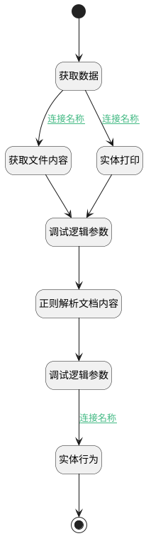

## 文档解析处理 <!-- {docsify-ignore-all} -->

   

### 处理过程




### 处理步骤说明

#### 开始 :id=Begin<sup class="footnote-symbol"> <font color=gray size=1>[开始]</font></sup>


*- N/A*
#### 获取数据 :id=DEACTION_01<sup class="footnote-symbol"> <font color=gray size=1>[实体行为]</font></sup>


调用实体 [知识库文档(AI_KB_DOCUMENT)](module/ai/ai_kb_document.md) 行为 [Get](module/ai/ai_kb_document#行为) ，行为参数为`Default(传入变量)`

#### 获取文件内容 :id=RAWSFCODE_01<sup class="footnote-symbol"> <font color=gray size=1>[直接后台代码]</font></sup>


<p class="panel-title"><b>执行代码[Groovy]</b></p>

```groovy
def _default = logic.param('Default').getReal()
def _type = _default.get('type')
if (_type == 'file'){
    def iCloudOSSClient = sys.getSysUtilRuntime(net.ibizsys.central.cloud.core.sysutil.ISysCloudClientUtilRuntime.class, false).getServiceClient("cloud-oss", net.ibizsys.central.cloud.core.cloudutil.client.ICloudOSSClient.class, true)
    def fileJson = _default.get("file")
    if (fileJson){
        def file = new groovy.json.JsonSlurper().parseText(fileJson)
        if (file.size() > 0){
            println("输出file"+file[0])
            def fileId = file[0].id
            def folder = file[0].folder
            def fileText = iCloudOSSClient.downloadText(folder, fileId)
            _default.set("parsed_content", fileText)
        }
    }
}
```

#### 实体打印 :id=RAWSFCODE_03<sup class="footnote-symbol"> <font color=gray size=1>[直接后台代码]</font></sup>


<p class="panel-title"><b>执行代码[Groovy]</b></p>

```groovy
def _default = logic.param('Default').getReal()
def deCodeName = _default.get('source_type')
def dstEntityKey = _default.get('source_id')
if (deCodeName && dstEntityKey) {
    def dstEntityRuntime = sys.dataentity(deCodeName)
    def bos = new java.io.ByteArrayOutputStream()
    def dePrintCodeName = "chat_resource"
    def keys = [dstEntityKey] as Object[]
    dstEntityRuntime.outputPrint(
        dePrintCodeName,
        bos,
        keys,
        null,
        false
    )
    _default.set("parsed_content", bos.toString("utf-8"))
}
```

#### 调试逻辑参数 :id=DEBUGPARAM_01<sup class="footnote-symbol"> <font color=gray size=1>[调试逻辑参数]</font></sup>


> [!NOTE|label:调试信息|icon:fa fa-bug]
> 调试输出参数`Default(传入变量)`的详细信息


#### 正则解析文档内容 :id=RAWSFCODE_02<sup class="footnote-symbol"> <font color=gray size=1>[直接后台代码]</font></sup>


<p class="panel-title"><b>执行代码[Groovy]</b></p>

```groovy
def _default = logic.param('Default').getReal()
def parsed_content = _default.get('parsed_content')
def custom_chunk = _default.get('custom_chunk')
def parser_config
if (custom_chunk == 0){
    // 使用所属知识库默认规则
    def knowledge_base_runtime = sys.dataentity('ai_knowledge_base')
    def knowledge_base = knowledge_base_runtime.get(_default.get('kb_id'))
    if (knowledge_base){
        parser_config = knowledge_base.get('parser_config')
    }
}else if (custom_chunk == 1){
    // 使用自定义规则
    parser_config = _default.get('parser_config')
}
if (parser_config){
    // 1. 预处理规则
    def pre_process_rules = parser_config.get('pre_process_rules')
    if (pre_process_rules) {
        def rulesList = pre_process_rules.split(',')
        // 合并多余空格/换行（保留单个空格，移除连续空白）
        if (rulesList.contains('remove_extra_whitespace')) {
            parsed_content = parsed_content.replaceAll(/[\s\u3000]+/, ' ')
        }

        // 移除 <script> 和 <style> 内容（保留其他标签，如 <div>）
        if (rulesList.contains('remove_js_css')) {
            // 先移除 <script> 标签内容
            parsed_content = parsed_content.replaceAll(/<script[^>]*>[\s\S]*?<\/script>/, '')
            // 再移除 <style> 标签内容
            parsed_content = parsed_content.replaceAll(/<style[^>]*>[\s\S]*?<\/style>/, '')
        }

        // 剥离 HTML 标签（保留纯文本，如 <p>Hello</p> → Hello）
        if (rulesList.contains('remove_html_tags')) {
            parsed_content = parsed_content.replaceAll(/<[^>]+>/, '')
        }

        // 移除电子邮箱及 URL（精准匹配，避免误删）
        if (rulesList.contains('remove_emails_url')) {
            // 移除 URL（http/https 开头）
            parsed_content = parsed_content.replaceAll(/https?:\/\/[^\s]+/, '')
            // 移除电子邮箱（标准格式）
            parsed_content = parsed_content.replaceAll(/[\w\.-]+@[\w\.-]+\.\w+/, '')
        }

        // 统一中英文标点（如 “” → "，‘’ → '）
        if (rulesList.contains('normalize_punctuation')) {
            parsed_content = parsed_content
                .replace('，', ',')
                .replace('。', '.')
                .replace('！', '!')
                .replace('？', '?')
                .replace('；', ';')
                .replace('：', ':')
                .replace('（', '(')
                .replace('）', ')')
                .replace('“', '"')
                .replace('”', '"')
                .replace('‘', "'")
                .replace('’', "'")
        }
    }
    // 2. 自定义脱敏规则
    def data_masking_rules = parser_config.get('data_masking_rules')
    if (data_masking_rules){
        // 根据正则规则pattern对parsed_content进行替换
        def masked_data = logic.param('masked_data').getReal()
        for (data_masking_rule in data_masking_rules){
            def pattern = data_masking_rule.get('pattern')
            def replacement = data_masking_rule.get('replacement')?:''
            if (pattern){
                parsed_content = parsed_content.replaceAll(pattern, replacement)
            }
        }
    }
    def masked_data = logic.param('masked_data').getReal()
    masked_data.set("id", _default.get("id"))
    masked_data.set("parsed_content", parsed_content)
    masked_data.set("status", "3")

}
```

#### 调试逻辑参数 :id=DEBUGPARAM_02<sup class="footnote-symbol"> <font color=gray size=1>[调试逻辑参数]</font></sup>


> [!NOTE|label:调试信息|icon:fa fa-bug]
> 调试输出参数`masked_data`的详细信息


#### 实体行为 :id=DEACTION_02<sup class="footnote-symbol"> <font color=gray size=1>[实体行为]</font></sup>


调用实体 [知识库文档(AI_KB_DOCUMENT)](module/ai/ai_kb_document.md) 行为 [Update](module/ai/ai_kb_document#行为) ，行为参数为`masked_data`

#### 结束 :id=END_01<sup class="footnote-symbol"> <font color=gray size=1>[结束]</font></sup>


返回 `Default(传入变量)`


### 连接条件说明
#### 连接名称 :id=DEACTION_01-RAWSFCODE_03

`Default(传入变量).TYPE(文档类型)` NOTEQ `file` AND `Default(传入变量).SOURCE_TYPE(源类型)` ISNOTNULL AND `Default(传入变量).SOURCE_ID(源标识)` ISNOTNULL
#### 连接名称 :id=DEBUGPARAM_02-DEACTION_02

`masked_data(masked_data).ID(知识库文档标识)` ISNOTNULL
#### 连接名称 :id=DEACTION_01-RAWSFCODE_01

`Default(传入变量).TYPE(文档类型)` EQ `file` AND `Default(传入变量).FILE(上传文件)` ISNOTNULL


### 实体逻辑参数

|    中文名   |    代码名    |  数据类型    |  实体   |备注 |
| --------| --------| -------- | -------- | --------   |
|传入变量(<i class="fa fa-check"/></i>)|Default|数据对象|[知识库文档(AI_KB_DOCUMENT)](module/ai/ai_kb_document.md)||
|agent_context|agent_context|数据对象|[智能体业务上下文(AI_AGENT_CONTEXT)](module/ai/ai_agent_context.md)||
|lastreturn|lastreturn|上一次调用返回|||
|masked_data|masked_data|数据对象|[知识库文档(AI_KB_DOCUMENT)](module/ai/ai_kb_document.md)||
