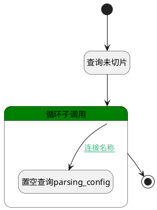

## 未切片数据集 <!-- {docsify-ignore-all} -->

   

### 处理过程

### 处理步骤说明

#### 开始 :id=Begin [开始]

*- N/A*
#### 查询未切片 :id=DEDATAQUERY_01 [实体数据查询]

调用实体 [知识库文档(AI_KB_DOCUMENT)](module/ai/ai_kb_document.md) 数据查询 [未解析文档(UNPARSED)](module/ai/ai_kb_document#数据查询) ，查询参数为`Default(传入变量)`

将执行结果返回给参数`page(文档)`

#### 循环子调用 :id=LOOPSUBCALL_01 [循环子调用]

循环参数`page(文档)`，子循环参数使用`doc`
#### 结束 :id=END_01 [结束]

返回 `page(文档)`

#### 置空查询parsing_config :id=PREPAREPARAM_01 [准备参数]

1. 将`空值（NULL）` 设置给  `doc.PARSER_CONFIG(解析配置)`

### 连接条件说明
#### 连接名称 :id=LOOPSUBCALL_01-PREPAREPARAM_01

`doc(doc).CUSTOM_CHUNK(自定义切片)` EQ `0`

### 实体逻辑参数

|    中文名   |    代码名    |  数据类型    |  实体   |备注 |
| --------| --------| -------- | -------- | --------   |
|传入变量(<i class="fa fa-check"/></i>)|Default|过滤器|||
|doc|doc|数据对象|[知识库文档(AI_KB_DOCUMENT)](module/ai/ai_kb_document.md)||
|文档|page|分页查询|||
