## 准备建立 <!-- {docsify-ignore-all} -->

   

### 处理过程

```plantuml
@startuml
hide empty description
<style>
root {
  HyperlinkColor #42b983
}
</style>

hide empty description
state "开始" as Begin <<start>> [[$./prepare_create#begin {"开始"}]]
state "准备参数" as PREPAREPARAM_01  [[$./prepare_create#prepareparam_01 {"准备参数"}]]
state "查看创建前的参数" as DEBUGPARAM_01  [[$./prepare_create#debugparam_01 {"查看创建前的参数"}]]


Begin --> DEBUGPARAM_01
DEBUGPARAM_01 --> PREPAREPARAM_01


@enduml
```

### 处理步骤说明

#### 开始 :id=Begin [开始]

*- N/A*
#### 准备参数 :id=PREPAREPARAM_01 [准备参数]

1. 将`Default(传入变量).parser_config` 设置给  `ai_kb_doc_wizard.PARSER_CONFIG(解析配置)`
2. 将`Default(传入变量).custom_chunk` 设置给  `ai_kb_doc_wizard.CUSTOM_CHUNK(自定义切片)`
3. 将`Default(传入变量).chunk_method` 设置给  `ai_kb_doc_wizard.CHUNK_METHOD(切片方法)`

#### 查看创建前的参数 :id=DEBUGPARAM_01 [调试逻辑参数]

> [!NOTE|label:调试信息|icon:fa fa-bug]
> 调试输出参数`Default(传入变量)`的详细信息

### 实体逻辑参数

|    中文名   |    代码名    |  数据类型    |  实体   |备注 |
| --------| --------| -------- | -------- | --------   |
|传入变量(<i class="fa fa-check"/></i>)|Default|数据对象|[知识库文档同步(AI_KB_DOCUMENT_SYNC)](module/ai/ai_kb_document_sync.md)||
|ai_kb_doc_wizard|ai_kb_doc_wizard|会话变量|||
